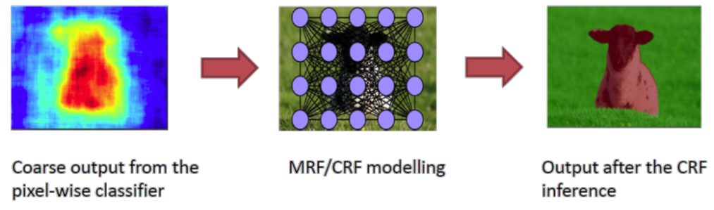
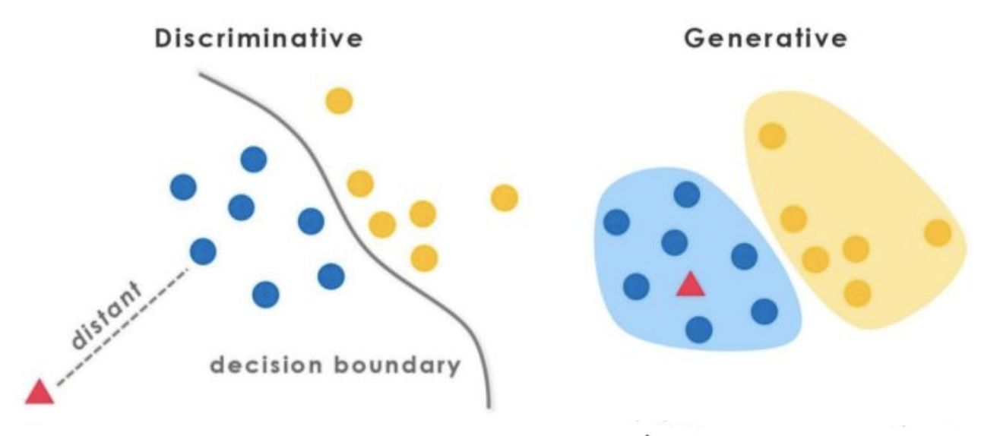
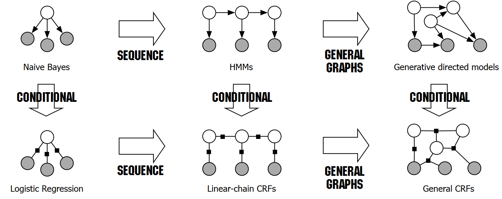
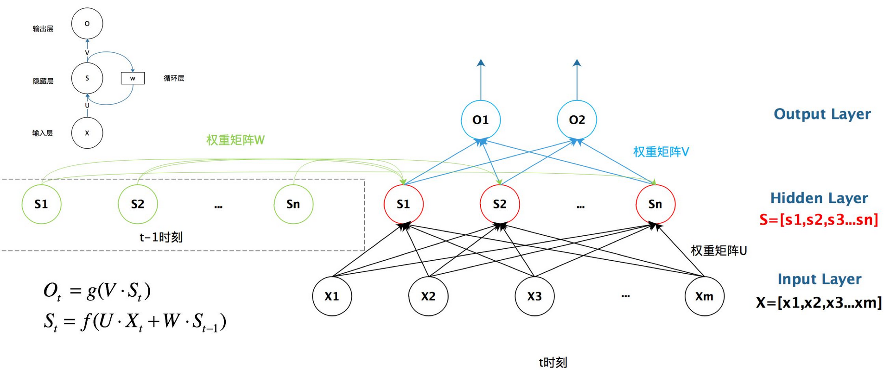
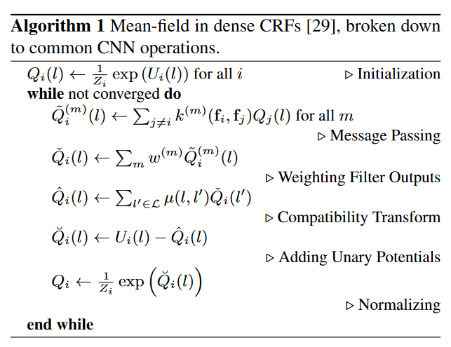
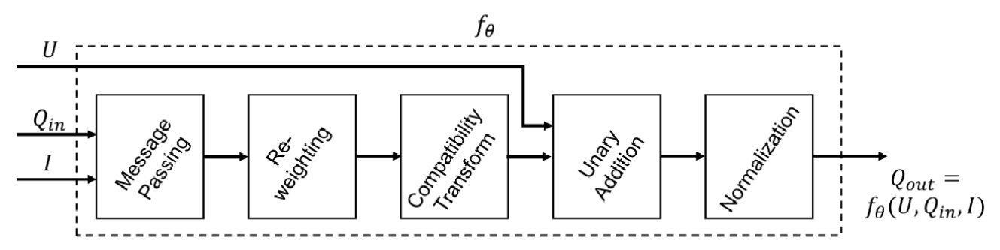
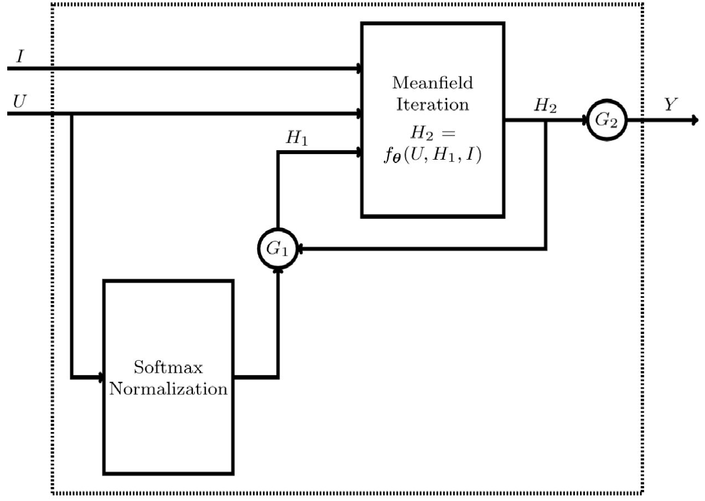
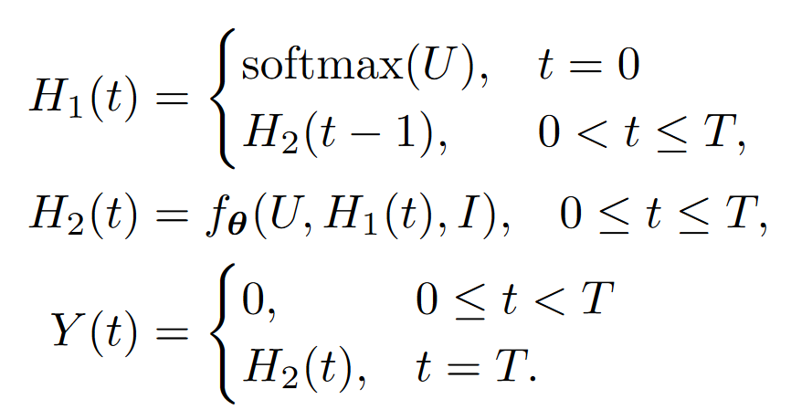

# Why CRF?

## CRF

### What does CRF do?

在仅使用 CNN 进行像素级标注的任务中，不可避免地存在如下问题：

* **精度低**：由于传统 CNN 的**大感受野**卷积滤波器，在输出像素集标签时会产生**粗略**的结果。最大池化层也降低了输出的精度，最终会导致**模糊边界**和**斑状图形**
* **缺乏约束**：CNN 缺乏平滑约束，包括相邻像素间的标签近似、标签输出的空间与外观一致等。会导致不准确的对象描述与细小的错误区域

而 CRF **势函数**可以包含使相似像素之间标签一致最大的**平滑项**，并可以进一步集成更细致的项来建模对象类之间**上下文信息**

PGM 的**作用**：增强像素级标注任务 (pixel-level labeling) 的准确性

应用 CRF 进行语义标注的**关键**：将**标签分配问题**建模成**概率推断问题**，并将**相似像素标签一致性**等假设包含在其**约束**中

用于像素级标签预测的 CRF 将**像素标签**建模为**全局观察（图像）**条件下的 MRF 中的**随机变量**

### Definition

在势函数取指数族函数的情况下：
$$
p(\mathbf{y}|\mathbf{x})=\frac{1}{Z(\mathbf{x})}\prod_{C_p\in\mathcal{C}}{\prod_{\Psi_c\in C_p}{\Psi_c(\mathbf{x}_c,\mathbf{y}_c;\theta_p)}}\\
\Psi_c(\mathbf{x}_c,\mathbf{y}_c;\theta_p)=\exp\left\{\sum_{k=1}^{K(p)}{\theta_{pk}f_{pk}(\mathbf{x}_c,\mathbf{y}_c)}\right\}\\
Z(\mathbf{x})=\sum_{\mathbf{x}}{\prod_{C_p\in\mathcal{C}}{\prod_{\Psi_c\in C_p}{\Psi_c(\mathbf{x}_c,\mathbf{y}_c;\theta_p)}}}
$$
其中，

*  $C_p$ 是一个团模板（一些最大团的集合），是对应的某种势函数的集合，与某组参数 $\theta_p$ 绑定；

* $\Psi_c(\mathbf{x}_c,\mathbf{y}_c;\theta_p)$ 则是团模板中的势函数，由于其取指数族函数，因此其形式为指数内特征函数加权和
* $f_{pk}(\mathbf{x}_c,\mathbf{y}_c)$ 是在团上的第 k 个特征函数，$\theta_{pk}$ 是其对应的参数（权重）

特别地，线性链 CRF
$$
p(\mathbf{y}|\mathbf{x})=\frac{1}{Z(\mathbf{x})}\prod_{t=1}^T{\exp\left\{\sum_{k=1}^K{\theta_{k}f_{k}(y_t,y_{t-1},\mathbf{x}_t)}\right\}}\\
$$

### Pixel-level Labeling

$$
P(\mathbf{X}|\mathbf{I})=\frac{1}{Z(\mathbf{I})}\exp(-\sum_{c\in\mathcal{C}_{\mathcal{g}}}{\phi_c(\mathbf{X}_c|\mathbf{I})})=\frac{1}{Z(\mathbf{I})}\exp(-E(\mathbf{x}|\mathbf{I}))\\
E(\mathbf{x}|\mathbf{I})=\sum_i{\psi_u(x_i)}+\sum_{i<j}{\psi_p(x_i,x_j)}
$$

在定义中将 Gibbs 能量分解为两个部分：Unary Potential 和 Pairwise Potential

* Unary Potential 由传统的分类器为每个像素单独计算

* Pairwise Potential 则进一步细化特征函数
  $$
  \psi_p(x_i,x_j)=\mu(x_i,x_j)\sum_{m=1}^K{w^{(m)}k^{(m)}(\mathbf{f}_i,\mathbf{f}_j)}
  $$
  其中，$k^{(m)}$ 是高斯核，$\mathbf{f}_i,\mathbf{f}_j$ 是特征向量，$w^{(m)}$ 是线性权重，这个求和项（高斯核的加权和）记作 $k(\mathbf{f}_i,\mathbf{f}_j)$ 

  $\mu(x_i,x_i)$ 是兼容函数，用于对赋予了不同标签的邻近像素给予**惩罚**，但需要注意的是，针对标签的类别不同应当对惩罚大小做出相应的调整（如，天空与鸟的惩罚小一些，天空与猫的惩罚大一些）

在标记任务中，我们采用在 Pairwise Potential 中使用两个核，即
$$
k(\mathbf{f}_i,\mathbf{f}_j)=w^{(1)}\exp(-\frac{|p_i-p_j|^2}{2\theta_\alpha^2}-\frac{|I_i-I_j|^2}{2\theta_\beta^2})+w^{(2)}\exp(-\frac{|p_i-p_j|^2}{2\theta_\gamma^2})
$$
其中，$p_i,p_j$ 是像素位置，$I_i,I_j$ 是像素颜色向量；第一个核称为外表核、第二个称为平滑核

### Equations & Parameters

$$
k(\mathbf{f}_i,\mathbf{f}_j)=w^{(1)}\exp(-\frac{|p_i-p_j|^2}{2\theta_\alpha^2}-\frac{|I_i-I_j|^2}{2\theta_\beta^2})+w^{(2)}\exp(-\frac{|p_i-p_j|^2}{2\theta_\gamma^2})
$$

> In Semantic Segmentation Post Process: https://www.youtube.com/watch?v=nZVH4Rwj9-U

appearance kernel (pairwise bilateral) [$\alpha,\beta$]: 表征空间、颜色接近的像素标签应当近似

smoothness kernel (pairwise gaussian) [$\gamma$]: 用于去除小的孤立区域

变分推断最小化 KL 散度得到近似分布 Q 的迭代更新式
$$
Q_i(x_i=l)=\frac{1}{Z_i}\exp\left\{-\psi_u(x_i)-\sum_{l'\in\mathcal{L}}{\mu(l,l')\sum_{m=1}^K{w^{(m)}\sum_{j\ne i}{k^{(m)}(\mathbf{f}_i,\mathbf{f}_j)Q_j(l')}}}\right\}
$$
该式中，需要学习的参数包括：

* compatibility function $\mu(l,l')$ 
* bilateral parameter $\alpha,\beta$ 
* spatial parameter $\gamma$ 

## Why not HMM?

HMM
$$
P(\mathbf{x},\mathbf{y})=P(y_1)P(x_1|y_1)\prod_{i=2}^{n}{P(y_i|y_{i-1})P(x_i|y_i)}
$$
Linear-chain CRF
$$
P(\mathbf{y}|\mathbf{x})=\frac{1}{Z}\exp{\left( \sum_j{\sum_{i=1}^{n-1}{\lambda_jt_j(y_{i+1},y_i,\mathbf{x},i)}}+\sum_k{\sum_{i=1}^{n}{\mu_ks_k(y_i,\mathbf{x},i)}} \right)}
$$
两者的核心区别就在于建模思想的不同，HMM （生成式）构建的是联合概率分布，CRF （判别式）构建的是条件概率分布

* 首先 CRF 是**判别式模型**，应到到序列标注这种 token 级别的分类任务时，效果就会比生成式模型要好。
* HMM 的**假设会更强**，HMM 认为当前隐状态依赖于上一个隐状态，当前观测状态依赖于当前隐状态，而 CRF 的假设是没有那么强的，只要满足局部马尔可夫性就好，**太强的假设会过分简化建模的问题**，导致出来的结果并不好。
* 对于像序列标注、语义分割这种问题，结点间的**因果关系并不重要**，但需要通过加入某些东西来**约束相连结点之间的关联**，这时就可以加入 CRF

### Generative versus Discriminative Models

Generative

* 建模：$P_\theta(X,Y)$ 
* 训练：$\arg\max_\theta{P_\theta(X,Y)}=\arg\max_\theta{P(X|Y)\cdot P(Y)}$ 
* 预测：$y=\arg\max_y{P(y|x)}=\arg\max_y{\frac{P(x,y)}{P(x)}}=\arg\max_y{P(x,y)}=\arg\max_y{P(x|y)P(y)}$ 

Discriminative 

* 建模：$P_\theta(Y|X)$ 
* 训练：$\arg\max_\theta{P_\theta(Y|X)}$ 
* 预测：$y=\arg\max_y{P(y|x)}$ 

生成式模型考虑的是**联合分布**，而判别式模型考虑的是**条件分布**。

#### 从建模思路考虑

* 生成式模型对输入输出向量的联合概率分布进行建模，但超大的向量维度、复杂的依赖关系使得建模难度很大；如果全盘考虑这些依赖会导致模型不可解，而若是忽略一些依赖会导致模型的效果变差
* 判别式模型当值**仅涉及观测变量**的依赖关系不起作用，因此可以比联合概率模型拥有简单得多的结构

对于分类/判别任务来说，判别式模型要优于生成式模型：

* 判别式模型通过**最大化条件概率**直接输出输入的类别
* 生成式模型通过**最大化输入的联合概率**来得到输入的类别

> 举个例子，图像猫狗分类，从抽象的学习目标来说，判别模型通过学猫和狗的毛发、尾巴等等的**区别**来区分猫和狗，生成式模型通过学猫和狗各自的毛发类型、尾巴类型的**分布**等等。
>
> 给出一个样本 $x$，判别猫和狗，判别式模型直接可以用 $\arg⁡\max_yP(y|x)$ 来进行判断，这也是判别式模型的建模目标；对于生成式模型，是通过看 $P(x,y=猫)$ 和 $P(x,y=狗)$ 谁大来进行判断。可以看出，**判别模型能更直接应用到分类任务中**，而生成模型用于分类任务时，还需要"绕"一下。
>
> https://zhuanlan.zhihu.com/p/402132237

#### 从数学角度考虑

* 从**特征函数**视角看：HMM 的特征函数（状态转移概率与发射概率的结合）仅与前一时刻的**观测**相关；而 CRF 的特征函数中**观测**是不分时刻参与计算的

  > 当然这里的参与计算是一种模糊的说法，事实上由于马尔科夫性的存在，CRF 对当前节点产生影响的节点实际上应当仅包含马尔可夫毯中的节点

* 条件分布不包括观测变量概率分布的建模，这在分类任务中是不必要的

* *条件方法拥有更大的自由，不必要求先验与条件分布拥有一致的参数配置*

* 由于**生成式中**的参数配置需要同时符合输入分布与条件分布，为了更好的同时拟合两者，可能会牺牲条件分布的精度而提高输入分布的精度，但事实上我们不关注输入分布而只需要关注条件分布

  > “Intuitively, because the parameters θ in (2.11) are used in both the input distribution and the conditional, a good set of parameters must represent both well, potentially at the cost of trading off accuracy on p(y|x), the distribution we care about, for accuracy on p(x), which we care less about.” (Sutton and McCallum, 2010, p. 20) 

* 生成式模型的优点：

  * 生成模型可以更自然地处理潜在变量、部分标记的数据和未标记的数据。
  * 在某些数据上，生成模型可以比判别模型表现得更好，直观上是因为输入模型 $p(x)$ 可能对条件有平滑效果。
  * 有时问题表明一个自然生成模型，或者应用程序需要预测未来输入和未来输出的能力，这使得生成模型更可取。

# CRF & RNN

## RNN

## CRF as RNN

我们的贡献是基于这样的观察，即**密集 CRF** 的基于滤波器的**近似平均场推断**方法依赖于在每次迭代中对平均场近似应用**高斯空间和双边滤波器**。

> “Our contribution is based on the observation that filter-based approximate mean-field inference approach for dense CRFs relies on applying Gaussian spatial and bilateral filters on the mean-field approximates in each iteration.” (Zheng et al., 2015, p. 4) 

### Initialization

等效于在每个像素的所有标签上的一元势 U 上应用 softmax 函数。

**back-propagation**: 通常反向传播操作

### Message Passing

消息传递是通过在 $Q$ 值上应用 $M$ 高斯滤波器实现的

由于 Dense CRF 的全连接特性，使用 Permutohedral lattice 来计算滤波器响应可以有效降低响应值计算的复杂度

**back-propagation**: 误差梯度通过同样的 $M$ 高斯滤波器反向计算得到

### Weighting Filter Outputs

这一步是对每个标签取 $M$ 个特征函数值的加权和，由于这里每个特征都是单独考虑，因此可以视作输入 $1\times1\times M$ 、输出 $1$ 的卷积层

在这一步中，针对不同的标签来设置不同的权重组合，主要是考虑到不同的标签类别对于 bilateral kernel 的重视程度不同

**back-propagation**: 通常反向传播操作

### Compatibility Transform

这一步可以看作是另一个卷积层，其中滤波器的空间感受野为 $1\times1$ ，输入和输出通道均为 $L$ 

**back-propagation**: 通常反向传播操作

### Adding Unary Potentials

**back-propagation**: 通常反向传播操作

### Normalization

归一化同样可以看作一个 softmax 操作

**back-propagation**: 通常反向传播操作

### CRF-RNN

将这个过程看作 RNN 的话，重复使用的量就是前一时刻输出的 $Q$ 值

将其封装成 CRF-RNN 模块，并将各处的数据流公式化

