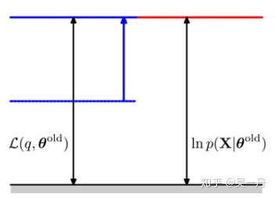
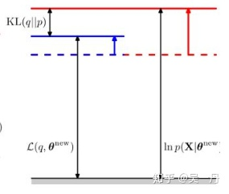
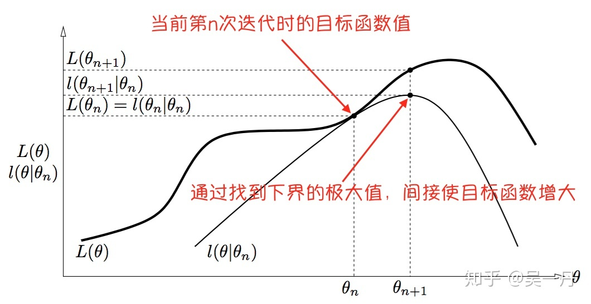

# 一些拓展概念

## EM 算法和 GEM 算法

> https://blog.csdn.net/IceelfLuo/article/details/108559105
>
> https://blog.csdn.net/IceelfLuo/article/details/108684257
>
> https://zhuanlan.zhihu.com/p/37543759

### EM 算法 (Expectation Maximization)

**实质**：EM算法就是含有**隐变量**的**概率模型参数**的**极大似然估计法**，或**极大后验概率估计法**。

**策略**：建立下界，并求该下界的最大值，重复这个过程，直到收敛到局部最大值；可以看作用坐标下降法来最大化对数似然下界的过程

令，$\bold{X}$ 表示已观测变量集，$\bold{Z}$ 表示隐变量集，$\Theta$ 表示模型参数，若欲对 $\Theta$ 做极大似然估计，则应最大化对数似然
$$
LL(\Theta|\bold{X},\bold{Z})=\ln P(\bold{X},\bold{Z}|\Theta)
$$
由于 $\bold{Z}$ 是隐变量，上式无法直接求解。通过对 $\bold{Z}$ 计算期望，来最大化已观测数据对数的**对数“边际似然”**
$$
LL(\Theta|\bold{X})=\ln P(\bold{X}|\Theta)=\ln \sum_{\bold{Z}}{P(\bold{X},\bold{Z}|\Theta)}
$$
EM 方法的基本思想是：若参数 $\Theta$ 己知，则可根据训练数据推断出最优隐变量 $\bold{Z}$ 的值 (E 步)；反之，若 $\bold{Z}$ 的值已知，则可
方便地对参数 $\Theta$ 做极大似然估计(M 步)

* **E 步** Expectation：以当前参数 $\Theta^t$ 推断隐变量分布 $P(\bold{Z}|\bold{X},\Theta^t)$ ，并计算对数似然 $LL(\Theta|\bold{X},\bold{Z})$ 关于 $\bold{Z}$ 的期望
  $$
  Q(\Theta|\Theta^t)=\mathbb{E}_{\bold{Z}|\bold{X},\Theta^t}LL(\Theta|\bold{X},\bold{Z})=\sum_{\bold{Z}}{P(\bold{Z}|\bold{X},\Theta^t)\ln P(\bold{X},\bold{Z}|\Theta)}
  $$

* **M 步** Maximization：寻找参数最大化期望似然，即
  $$
  \Theta^{t+1}=\mathop{\arg\max}_{\Theta}Q(\Theta|\Theta^t)
  $$

EM 算法使用两个步骤变替计算：第一步是期望(E)步，利用当前估计的参数值来计算**对数似然的期望值**（对数边际似然）；第二步是最大化(M)步，寻找能使 EM 算法的收敛性分析 E 步产生的**似然期望最大化的参数值**。然后，新得到的参数值重新被用于 E 步，……直至收敛到局部最优解

这里对收敛的定义为：$\|Q(\Theta^{t+1}|\Theta^t)-Q(\Theta^t|\Theta^t)\|$ 足够小

### GEM 算法 (Generalized Expectation Maximization)

EM算法中引入的是隐变量，如果我们将隐变量理解为**隐分布**，就得到了广义 EM 算法，它是在数据不完全或者存在缺失变量的情况下**参数估计**的迭代算法。

事件分布可以写作：
$$
p(x_i|\theta)=\frac{p(x_i,z_i)}{p(z_i|x_i)}
$$
两边同时取对数并除以隐变量的分布 $q_i(z_i)$ 则有
$$
\begin{split}
\log{p(x_i|\theta)}&=\log{p(x_i,z_i)}-\log{p(z_i|x_i)}=\log{\frac{p(x_i,z_i)}{q_i(z_i)}}-\log{\frac{p(z_i|x_i)}{q_i(z_i)}}\\
&=\log{p(x_i,z_i)}-\log{q_i(z_i)}-\log{\frac{p(z_i|x_i)}{q_i(z_i)}}\\
(对z求期望)&=\int{q_i(z_i)\log{p(x_i,z_i)dz}}-\int{q_i(z_i)\log{q_i(z_i)}dz}-\int{q_i(z_i)\log{\frac{p(z_i|x_i)}{q_i(z_i)}}dz}
\end{split}
$$
这里右侧的三项分别为：

* $E_{z_i}(\log{p(x_i,z_i)})=\int{q_i(z_i)\log{p(x_i,z_i)dz}}$ 
* $H(q_i)=\int{q_i(z_i)\log{q_i(z_i)}dz}$ 
* $-\mathrm{KL}(q_i(z_i)\|p(z_i|x_i))=\int{q_i(z_i)\log{\frac{p(z_i|x_i)}{q_i(z_i)}}dz}$ 

则**对数似然**被分解为了两项：**下界**与 **KL 散度**
$$
\log{p(x_i|\theta)}=\mathcal{L}(q,\theta)+\mathrm{KL}(q\|p)
$$
其中下界 $\mathcal{L}(q,\theta)=E_{z_i}(\log{p(x_i,z_i)})-H(q_i)$ 

理想情况下，KL 散度为0，则最大化 $\mathcal{L}$ 就可以得到最大化对数似然，考虑 $\mathcal{L}=E+H$ ，由于 $H(q_i)$ 是 $q_i$ 的熵，与 $\theta$ 无关，可以视作常数，并将 $q_i(z_i)=p_i(z_i|x_i)$ 代入到式中，有
$$
\begin{split}
\mathcal{L}&=E_{z_i}(\log{p(x_i,z_i)})+\text{const}\\
&=\int{q_i(z_i)\log{p(x_i,z_i)dz}}+\text{const}\\
&=\int{p_i(z_i|x_i)\log{p(x_i,z_i)dz}}+\text{const}\\
&=\sum_{z_i}{p_i(z_i|x_i)\log{p(x_i,z_i)}}+\text{const}
\end{split}
$$
最大化该式即可

GEM 步骤：

* E 步：
  $$
  \ln p(\bold{X}|\Theta^t)=\mathcal{L}(q,\Theta^t)+\text{KL}(q\|p)
  $$
  初始化 $\Theta^t$ ，计算 $q(\bold{Z})=p(\bold{Z}|\bold{X},\Theta^t)$ 
  
  

  设定 KL 为零，蓝色线代表的下界即为对数似然
  
* M 步：

  最大化 $\mathcal{L}(q,\Theta)$ 更新参数
  $$
  \Theta^{t+1}=\arg\max Q(\Theta,\Theta^t)
  $$
  
  
  下界上升、对数似然也随之上升，直到收敛至局部最优

## KL 散度 Kullback-Leibler divergence

> https://zhuanlan.zhihu.com/p/39682125
>
> https://hsinjhao.github.io/2019/05/22/KL-DivergenceIntroduction/
>
> https://zhuanlan.zhihu.com/p/45131536
>
> https://www.jiqizhixin.com/articles/2018-05-29-2

也称相对熵 relative entropy 或信息散度 information divergence，可用于**度量两个概率分布之间的差异**

给定两个概率分布 $P,Q$ ，二者之间的 KL 散度定义为
$$
\text{KL}(P\|Q)=\int_{-\infty}^{\infty}{p(x)\log\frac{p(x)}{q(x)}\text{d}x}
$$
其中 $p(x)$ 和 $q(x)$ 分别为 $P,Q$ 的概率密度函数

* KL 散度满足非负性：$\text{KL}(P\|Q)\ge0$ ，当且仅当 $P=Q$ 时 $\text{KL}(P\|Q)=0$ 
* KL 散度不满足对称性：$\text{KL}(P\|Q)\ne\text{KL}(Q\|P)$ 

将 KL 散度展开，得到
$$
\text{KL}(P\|Q)=\int_{-\infty}^{\infty}{p(x)\log p(x)\text{d}x}-\int_{-\infty}^{\infty}{p(x)\log q(x)\text{d}x}=-H(P)+H(P,Q)
$$
其中，$H(P)$ 为熵，$H(P,Q)$ 为 $P,Q$ 的交叉熵。

从信息论的角度看，KL 散度可以看作使用基于 $Q$ 的编码对来自 $P$ 的变量进行编码所需的“额外”字节数

## forward-backward 算法

> https://zhuanlan.zhihu.com/p/98397735
>
> https://blog.csdn.net/weixin_46233323/article/details/104833330

## PatchMatch 算法

> https://zhuanlan.zhihu.com/p/365675851