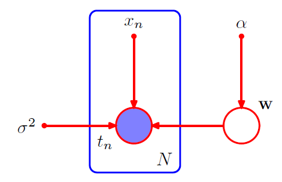

[TOC]

在概率图模型中，每个**结点**表示⼀个**随机变量**（或⼀组随机变量），**链接**表示这些变量之间的**概率关系**。这样，图描述了**联合概率分布**在所有随机变量上能够**分解为⼀组因子的乘积**的方式，每个因子只依赖于随机变量的⼀个子集。

* 有向图模型 directed graphical model: 贝叶斯网络 Bayesian network
* 无向图模型 undirected graphical models: 马尔科夫随机场 Markov random fields
* **有向图**用于表达随机变量之间的**因果关系**；**无向图**用于表示随机变量之间的**软限制**

# 贝叶斯网络

在图的所有结点上定义的**联合概率分布**由每个结点上的**条件概率分布的乘积**表⽰，每个条件概率分布的**条件**都是图中结点的**父结点所对应的变量**。因此，对于⼀个有 $K$ 个结点的图，联合概率为
$$
p(\boldsymbol{x})=\prod_{k=1}^K{p(x_k|pa_k)}
$$
其中，$pa_k$ 表示 $x_k$ 的父结点的集合，$\boldsymbol{x}=\{x_1,\cdots,x_K\}$ 

这个关键的方程表示有向图模型的联合概率分布的**分解（factorization）**属性。

有向图的**重要限制**：不能存在有向环，即不能存在“从某个结点开始，沿着链接中箭头的方向运动，结束点为起点”的路径。这称为**有向无环图 Directed Acyclic Graph, DAG**

**随机变量**由**空心圆**表示，**确定性参数**由**小的实心圆**表示；通过给对应的结点加上**阴影**的来表示观测变量。

* 例如：用有向图表示贝叶斯多项式拟合模型
  $$
  p(\boldsymbol{t},\boldsymbol{w}|\boldsymbol{x},\alpha,\sigma^2)=p(\boldsymbol{w}|\alpha)\prod_{n=1}^N{p(t_n|\boldsymbol{w},x_n,\sigma^2)}
  $$
  其中，$\boldsymbol{t,w}$ 是模型中的**随机变量**，$\boldsymbol{x},\alpha,\sigma^2$ 是**模型参数**，上式显示地写出了模型的参数和随机变量，有向图表示如下

