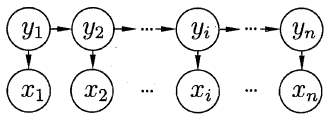
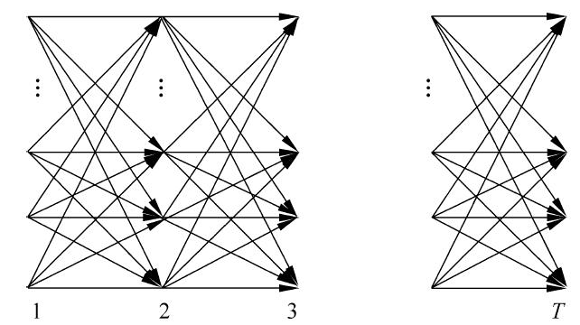
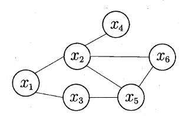
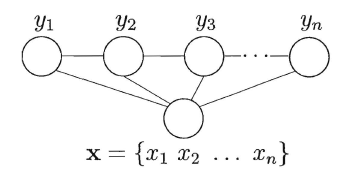
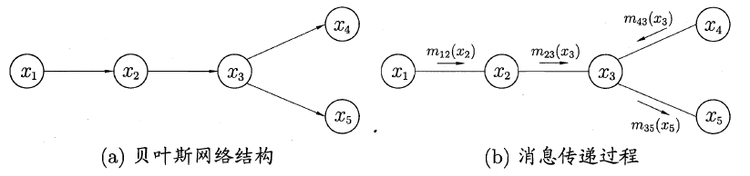
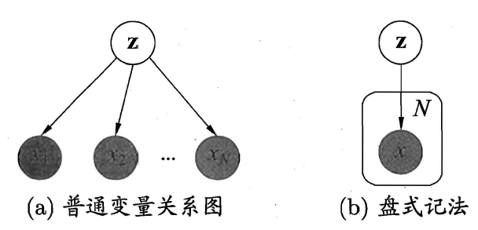
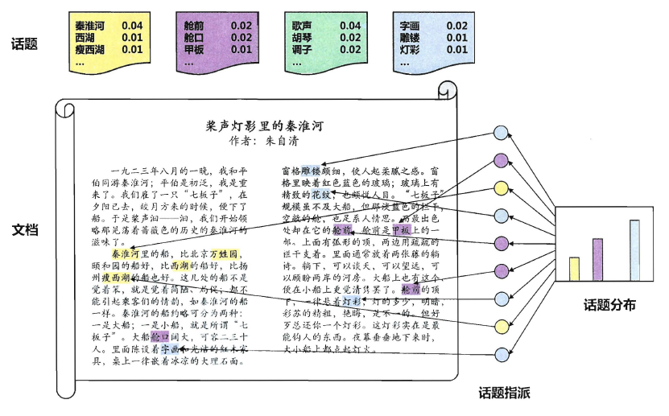
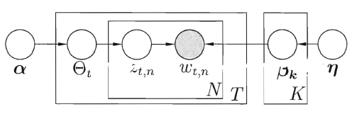
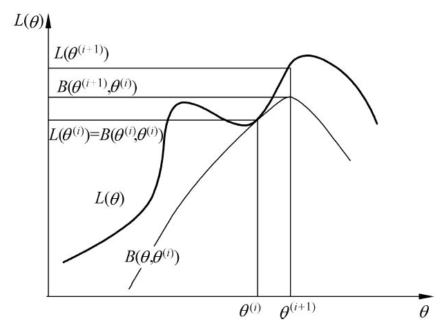

[TOC]

# 隐马尔可夫模型 Hidden Markov Model

## 推断 inference

利用已知变量推测未知变量的分布称为"**推断**" (inference) ，其核心是如何基于**可观测变量**推测出**未知变量**的条件分布。

假定所关心的变量集合为 $Y$ 可观测变量集合为 $O$ ，其他变量的集合为 $R$ ，

* “生成式” (generative) 模型：考虑联合分布 $P(Y,R,O)$；
* “判别式” (discriminative) 模型：考虑条件分布 $P(Y,R|O)$ ； 

给定一组观测变量值，推断就是要由 $P(Y,R,O)$ 或 $P(Y,R|O)$ 得到条件概率分布 $P(Y|O)$  

## 概率图模型 Probabilistic Graphical Model

概率图模型 (probabilistic graphical model) 是一类用**图**来表达**变量相关关系**的概率模型。大致可分为两类：

* 使用**有向无环图**表示变量间的依赖关系，称为**有向圈模型**或**贝叶斯网** (Bayesian network)；
* 使用**无向图**表示变量间的相关关系，称为**无向图模型**或**马尔可夫网** (Markov network).

## 隐马尔可夫模型 Hidden Markov Model

**隐马尔可夫模型**(Hidden Markov Model，简称HMM) 是结构最筒单的**动态贝叶斯网**(dynamic Bayesian network)：隐马尔可夫模型是**关于时序**的概率模型，描述由**一个隐藏的马尔可夫链随机生成不可观测的状态随机序列**，再由各个状态生成一个观测从而**产生观测随机序列**的过程。隐藏的马尔可夫链随机生成的状态的序列，称为**状态序列**（state）；每个状态生成一个观测，而由此产生的观测的随机序列，称为**观测序列**（observation sequence）。序列的每一个位置又可以看作是一个时刻。

* 状态变量（隐变量）： $\{y_1,y_2,\cdots,y_n\}$ ，其中 $y_i\in\mathcal{Y}$ 表示第 $i$ 时刻的系统状态，

  $\mathcal{Y}$ 取值范围为 $\{s_1,s_2,\cdots,s_N\}$ 

* 观测变量： $\{x_1,x_2,\cdots,x_n\}$ ，其中 $x_i\in\mathcal{X}$ 表示第 $i$ 时刻的观测值

  $\mathcal{X}$ 取值范围为 $\{o_1,o_2,\cdots,o_M\}$ 

* 任一时刻，观测变量的值**仅依赖于**状态变量，即 $x_t$ 由 $y_t$ 确定。且，$t$ 时刻的状态 $y_t$ 仅依赖于 $t-1$ 时刻的状态 $y_{t-1}$  

* **马尔可夫链** (Markov chain)：系统下一时刻的状态仅由当前状态决定，不依赖于以往的任何状态。
  
  基于这种依赖关系，所有变量的联合概率分布为
  $$
  P(x_1,y_1,\cdots,x_n,y_n)=P(y_1)P(x_1|y_1)\prod_{i=2}^{n}{P(y_i|y_{i-1})P(x_i|y_i)}
  $$
  确定一个隐马尔可夫模型还需要三组参数：
  
  1. **状态转移概率**：模型在各状态间转换的概率，通常记为 $\mathbf{A}=[a_{ij}]_{N\times N}$ ，其中
     $$
     a_{ij}=P(y_{t+1}=s_j|y_t=s_i), 1\leq i,j\le N
     $$
     意为任意时刻 $t$ ，若状态为 $s_i$ ，则下一时刻状态为 $s_j$ 的概率
  
  2. **输出观测概率**：模型根据**当前状态**获得**各个观测值**的概率，通常记为矩阵 $\mathbf{B}=[b_{ij}]_{N\times M}$ ，其中
     $$
     b_{ij}=P(x_t=o_j|y_t=s_i), 1\leq i\leq N, 1\leq j \leq M
     $$
     意为任意时刻 $t$ ，若状态为 $s_i$ ，则观测值 $o_j$ 被获取的概率
  
  3. **初始状态概率**：模型在初始时刻各状态出现的概率，通常记为 $\mathbf{\pi}=(\pi_1,\pi_2,\cdots,\pi_N)$ ，其中
     $$
     \pi_i=P(y_1=s_i), 1\leq i\leq N
     $$
     意为模型初始状态为 $s_i$ 的概率
  
  > https://www.cnblogs.com/skyme/p/4651331.html
  
* 通过指定状态空间 $\mathcal{Y}$、观测空间 $\mathcal{X}$ 和上述三组参数，就能确定一个隐马尔可夫模型，通常用其参数 $\lambda=[\mathbf{A},\mathbf{B},\mathbf{\pi}]$ 来指代

* 隐马尔可夫模型的三个**基本问题**：

  1. （概率计算问题）如何评估**模型**与**观测序列**之间的匹配程度：给定模型 $\lambda=[\mathbf{A},\mathbf{B},\mathbf{\pi}]$ ，如何有效计算其产生观测序列 $\mathbf{x}=\{x_1,x_2,\cdots,x_n\}$ 的概率 $P(\mathbf{x}|\lambda)$ 
  
     > 前向/后向算法
  
  2. （预测问题）如何根据**观测序列**推断出**隐藏的模型状态**：模型 $\lambda=[\mathbf{A},\mathbf{B},\mathbf{\pi}]$ 和观测序列 $\mathbf{x}=\{x_1,x_2,\cdots,x_n\}$ ，如何找到与此观测序列最匹配的状态序列 $\mathbf{y}=\{y_1,y_2,\cdots,y_n\}$ 
  
     > 贪心算法、维特比算法
  
  3. （学习问题）如何**训练模型**使其能最好地**描述观测数据**：给定观测序列 $\mathbf{x}=\{x_1,x_2,\cdots,x_n\}$ ，如何调整模型参数 $\lambda=[\mathbf{A},\mathbf{B},\mathbf{\pi}]$ ，使得该序列出现的概率 $P(\mathbf{x}|\lambda)$ 最大
  
     > EM 算法、极大似然估计

## 概率计算算法

### 前向算法

**前向概率**：给定隐马尔可夫模型 $\lambda$ ，定义到时刻 $t$ 部分观测序列为 $o_1,o_2,\cdots,o_t$ 且状态为 $s_i$ 的概率为前向概率，记作
$$
\alpha_t(i)=P(o_1,o_2,\cdots,o_t,y_t=s_i|\lambda)
$$
可以递推地求得前向概率 $\alpha_t(i)$ 及观测序列概率 $P(O|\lambda)$ ，算法如下：

输入：隐马尔可夫模型 $\lambda$ ，观测序列 $O$ 

输出：观测序列概率 $P(O|\lambda)$ 

1. 初值：$\alpha_1(i)=\pi_ib_i(o_1),\quad i=1,2,\cdots,N$ 

2. 递推：对 $t=1,2,\cdots,T-1$ ，有
   $$
   \alpha_{t+1}(i)=\left[\sum_{j=1}^N{\alpha_t(j)a_{ji}}\right]b_i(o_{t+1}),\quad i=1,2,\cdots,N
   $$

3. 终止：$P(O|\lambda)=\sum_{i=1}^N{\alpha_T(i)}$ 

> 前向算法使用基于“状态序列的路径结构”递推计算观测序列概率。
>
> 在初始化时，首先计算 $\alpha_1(i)$ 的 $N$ 个值；在各个时刻 $t=1,2,\cdots,T-1$ ，计算 $\alpha_{t+1}(i)$ 的 $N$ 个值，且**每个 $\alpha_{t+1}(i)$ 的计算利用了前一时刻的 $N$ 个 $\alpha_t(j)$** 

### 后向算法

**后向概率**：给定隐马尔可夫模型 $\lambda$ ，定义在时刻 $t$ 状态为 $s_i$ 的条件下，从 $t+1$ 到 $T$ 的部分观测序列为 $o_{t+1},o_{t+2},\cdots,o_T$ 的概率为后向概率，记作
$$
\beta_t(i)=P(o_{t+1},o_{t+2},\cdots,o_T|y_t=s_i,\lambda)
$$
可以递推地求得后向概率 $\beta_t(i)$ 及观测序列概率 $P(O|\lambda)$ ，算法如下：

输入：隐马尔可夫模型 $\lambda$ ，观测序列 $O$ 

输出：观测序列概率 $P(O|\lambda)$ 

1. 初始化后向概率：$\beta_T(i)=1,\quad i=1,2,\cdots,N$ 

2. 递推公式：对 $t=T-1,T-2,\cdots,1$ 
   $$
   \beta_t(i)=\sum_{j=1}^N{a_{ij}b_j(o_{t+1})\beta_{t+1}(j)},\quad i=1,2,\cdots,N
   $$

3. 终止：$P(O|\lambda)=\sum_{i=1}^N{\pi_ib_i(o_1)\beta_1(i)}$ 

> 与前向算法类似，后向算法也利用了同样的规律从后向前递推
>
> 在初始化时，规定最后的 $\beta_T(i)=1$ ；在各个时刻 $t=1,2,\cdots,T-1$ ，计算 $\beta_t(i)$ 的 $N$ 个值，且**每个 $\beta_t(i)$ 的计算都利用了后一时刻的 $N$ 个 $\beta_{t+1}(j)$** 

综上，利用前向概率与后向概率可以将观测序列概率写成
$$
P(O|\lambda)=\sum_{i=1}^N{\sum_{j=1}^N{\alpha_t(i)a_{ij}b_j(o_{t+1})\beta_{t+1}(j)}},\quad t=1,2,\cdots,T-1
$$

### 前向后向算法应用

* 给定模型 $\lambda$ 和观测 $O$ ，则在时刻 $t$ 处于状态 $s_i$ 的概率为：
  $$
  \gamma_t(i)=P(y_t=s_i|O,\lambda)=\frac{P(y_t=s_i,O|\lambda)}{P(O|\lambda)}=\frac{\alpha_t(i)\beta_t(i)}{\sum_{j=1}^N{\alpha_t(j)\beta_t(j)}}
  $$

* 给定模型 $\lambda$ 和观测 $O$ ，则在时刻 $t$ 处于状态 $s_i$ 且在时刻 $t+1$ 处于状态 $s_j$ 的概率为：
  $$
  \begin{split}
  \xi_t(i,j)&=P(y_t=s_i,y_{t+1}=s_j|O,\lambda)=\frac{P(y_t=s_i,y_{t+1}=s_j,O|\lambda)}{P(O|\lambda)}\\
  &=\frac{\alpha_t(i)a_{ij}b_j(o_{t+1})\beta_{t+1}(j)}{\sum_{i=1}^N{\sum_{j=1}^N}{\alpha_t(i)a_{ij}b_j(o_{t+1})\beta_{t+1}(j)}}
  \end{split}
  $$

* 将 $\gamma_t(i)$ 和 $\xi_t(i,j)$ 对各个时刻 $t$ 求和，可以得到一些有用的期望值

  * 在观测 $O$ 下状态 $i$ 出现的期望值：$\sum_{t=1}^T{\gamma_t(i)}$ 
  * 在观测 $O$ 下由状态 $i$ 转移的期望值：$\sum_{t=1}^{T-1}{\gamma_t(i)}$ 
  * 在观测 $O$ 下由状态 $i$ 转移到状态 $j$ 的期望值：$\sum_{t=1}^{T-1}{\xi_t(i,j)}$ 

## 学习算法

训练数据是包括**观测序列**和对应的**状态序列**：监督学习

训练数据只包括**观测序列**：无监督学习

### 监督学习方法

假设：己给训练数据包含 $S$ 个长度相同的**观测序列**和对应的**状态序列** $\{(x_1,y_1),(x_2,y_2),\cdots,(x_S,y_S)\}$ ，那么可以利用**极大似然估计法**来估计隐马尔可夫模型的参数。

1. **转移概率** $a_{ij}$ 的估计

   设，样本中时刻 $t$ 处于状态 $i$ 、时刻 $t+1$ 转移到状态 $j$ 的频数为 $A_{ij}$ ，那么状态转移概率 $a_{ij}$ 的估计是
   $$
   \hat{a}_{ij}=\frac{A_{ij}}{\sum_{j=1}^N{A_{ij}}},\quad i=1,2,\cdots,N;j=1,2,\cdots,N
   $$

2. **观测概率** $b_j(k)$ 的估计（ $b_{jk}$ ）

   设，样本中状态为 $j$ 并观测为 $k$ 的频数是 $B_{jk}$ ，那么状态为 $j$ 观测为 $k$ 的概率 $b_j(k)$ 的估计是
   $$
   \hat{b}_j(k)=\frac{B_{jk}}{\sum_{k=1}^M{B_{jk}}},\quad j=1,2,\cdots,N;k=1,2,\cdots,M
   $$

3. **初始概率** $\pi_i$

   $\pi_i$ 的估计为 $S$ 个样本中初始状态为 $s_i$ 的频率

### Baum-Welch 算法

假设：给定训练数据只包含 $S$ 个长度为 $T$ 的观测序列 $\{x_1,x_2,\cdots,x_S\}$ 而没有对应的状态序列，目标是学习**隐马尔可夫模型** $\lambda=(A,B,\pi)$ 的参数。将观测序列数据看作观测数据 $X$ ，状态序列数据看作不可观测的隐数据 $Y$ ，那么隐马尔可夫模型事实上是一个含有隐变量的概率模型
$$
P(X|\lambda)=\sum_Y{P(X|Y,\lambda)P(Y|\lambda)}
$$
输入：观测数据 $X=(x_1,x_2,\cdots,x_T)$ 

输出：隐马尔可夫模型参数

1. 初始化：对 $n=0$ ，选取 $a_{ij}^{(0)},b_j(k)^{(0)},\pi_i^{(0)}$ ，得到模型 $\lambda^{(0)}=(A^{(0)},B^{(0)},\pi^{(0)})$ 

2. 递推：对 $n=1,2,\cdots$ 
   $$
   a_{ij}^{(n+1)}=\frac{\sum_{t=1}^{T-1}{\xi_t(i,j)}}{\sum_{t=1}^{T-1}{\gamma_t(i)}}\\
   b_j(k)^{(n+1)}=\frac{\sum_{t=1,x_t=v_k}^T{\gamma_t(j)}}{\sum_{t=1}^{T}{\gamma_t(j)}}\\
   \pi_i^{(n+1)}=\gamma_1(i)
   $$

3. 终止：得到模型参数 $\lambda^{(n+1)}=(A^{(n+1)},B^{(n+1)},\pi^{(n+1)})$ 

> 详细推导请参考《统计学习方法》P227

## 预测算法

> 《统计学习方法》P231

# 马尔可夫随机场 Markov Random Field

无向图随机模型，图中每个结点表示一个或一组变量，结点之间的边表示两个变量之间的相关关系。

概率无向图模型（马尔可夫随机场）：设有联合概率分布 $P(Y)$ ，由无向图 $G(V,E)$ 表示，在图 $G$ 中，结点表示随机变量，边表示随机变量之间的依赖关系。如果联合概率分布 $P(Y)$ 满足**成对、局部或全局马尔可夫性**，就称此联合概率分布为概率无
向图模型（probabilistic undirected graphical model），或马尔可夫随机场（Markov random field）。

* **势函数**(potential functions) ，亦称"**因子**" (factor) ，这是定义在变量子集上的非负实函数， 主要用于定义概率分布函数。

## 条件独立性

* **分离集** (separating set)：若从结点集 $A$ 中的结点到 $B$ 中的结点都必须经过结点集 $C$ 中的结点，则称结点集 $A$ 和 $B$ 被结点集 $C$ 分离， $C$ 称为“分离集”。
* **全局马尔可夫性** (global Markov property)：给定两个变量子集的分离集，则这两个变量子集条件独立，记为 $\mathbf{x}_A\bot\mathbf{x}_B|\mathbf{x}_C$ 
* **局部马尔可夫性** (local Markov property)：给定某变量的邻接变量，则该变量条件独立于其他变量。形式化地说，令 $V$ 为图的结点集，$n(v)$ 为结点 $v$ 在图上的邻接结点，令$n^*(v)=n(v)\cup {v}$ ，则有 $\mathbf{x}_v\bot \mathbf{x}_{V\setminus n^*(v)}|\mathbf{x}_{n(v)}$ 
  * 在 $P(\mathbf{x}_{V\setminus n^*(v)}|P(\mathbf{x}_{n(v)}))>0$ 时，等价地有：$P(\mathbf{x}_v|\mathbf{x}_{n(v)})=P(\mathbf{x}_v|\mathbf{x}_{n(v)},\mathbf{x}_{V\setminus n^*(v)})$ 
  * 马尔可夫毯 (Markov blanket)：某变量的所有邻接变量组成的集合称为该变量的“马尔可夫毯”
* **成对马尔可夫性** (pairwise Markov property)：给定所有其他变量，两个非邻接变量条件独立。形式化地说，令图的结点集和边集分别为 $V$ 和 $E$ ，对图中的两个结点 $u$ 和 $v$ ，若 $\langle u,v \rangle \notin E$ ，则有 $\mathbf{x}_u\bot\mathbf{x}_v|\mathbf{x}_{V\setminus \langle u,v \rangle}$ 

## 团 clique

对于图中结点的一个子集，若其中任意两结点间都有边连接，则称该结点子集为一个“团”

* **极大团** (maximal clique) ：在一个团中加入另外任何一个结点都不再形成团，也即不能被其他团所包含的团。显然，每个结点至少出现在一个极大团中。

* 在马尔可夫随机场中，多个变量之间的联合概率分布能基于团分解为**多个因子的乘积**，每个因子仅与一个团相关。

  对 $n$ 个变量 $\mathbf{x}=\{x_1,x_2,\cdots,x_n\}$ ，所有团构成的集合为 $\mathcal{C}$ ，与团 $Q\in \mathcal{C}$ 对应的变量集合记为 $\mathbf{x}_Q$ ，则联合概率 $P(\mathbf{x})$ 定义为：
  $$
  P(\mathbf{x})=\frac{1}{Z}\prod_{Q\in \mathcal{C}}{\psi_Q(\mathbf{x}_Q)}
  $$
  其中，$\psi_Q$ 为与团 $Q$ 对应的势函数，用于对团 $Q$ 中的变量进行建模；$Z=\sum_{\mathbf{x}}\prod_{Q\in \mathcal{C}}{\psi_Q(\mathbf{x}_Q)}$ 为规范化因子，以确保 $P(\mathbf{x})$ 是被正确定义的概率。

* 联合概率 $P(\mathbf{x})$ 可以**基于极大团来定义**，假定所有极大团构成的集合为 $\mathcal{C}^*$ ，则有：
  $$
  P(\mathbf{x})=\frac{1}{Z^*}\prod_{Q\in \mathcal{C}^*}{\psi_Q(\mathbf{x}_Q)}
  $$
  其中，$Z^*=\sum_{\mathbf{x}}\prod_{Q\in \mathcal{C}^*}{\psi_Q(\mathbf{x}_Q)}$ 为规范化因子。在被包含在极大团中的团不需要单独计算势函数。

## 势函数 potential functions

* 势函数 $\psi_Q(\mathbf{x}_Q)$ 的作用是定量刻画变量集 $\mathbf{x}_Q$ 中变量之间的相关关系，它应该是非负函数，且在所偏好的变量取值上有较大函数值。

* 为了满足非负性，指数函数常被用于定义势函数，即
  $$
  \psi_Q(\mathbf{x}_Q)=e^{-H_Q(\mathbf{x}_Q)}
  $$
  $H_Q(\mathbf{x}_Q)$ 是一个定义在变量 $\mathbf{x}_Q$ 上的实值函数，常见形式为
  $$
  H_Q(\mathbf{x}_Q)=\sum_{u,v\in Q,u\ne v}{a_{uv}x_ux_v}+\sum_{v\in Q}{\beta_vx_v}
  $$
  其中，$a_{uv}$ 和 $\beta_v$ 是参数，上式中第二项仅考虑单结点，第一项则考虑每一对结点的关系。

# 条件随机场 Conditional Random Field

> 更详细的关于条件随机场的论述请阅读
> 
> Sutton, Charles, and Andrew McCallum. “An Introduction to Conditional Random Fields.” arXiv, November 17, 2010. http://arxiv.org/abs/1011.4088.

是一种**判别式**无向图模型。与隐马尔可夫模型和马尔可夫随机场不同的是，条件随机场是对**条件分布**进行建模，而之前两者则是对**联合分布**进行建模。

是给定一组输入随机变量的条件下另一组输出随机变量的**条件概率分布模型**，其特点是假设**输出随机变量构成马尔可夫随机场**

* 假定，观测序列： $\mathbf{x}=\{x_1,x_2,\cdots,x_n\}$ ，与之对应的标记序列：$\mathbf{y}=\{y_1,y_2,\cdots,y_n\}$ ，则条件随机场的**目标**是构建条件概率模型 $P(\mathbf{y}|\mathbf{x})$ 

* 令 $G=\langle V,E\rangle$ 表示结点与标记变量 $\mathbf{y}$ 中元素一一对应的无向图，$y_v$ 表示与结点 $v$ 对应的标记变量，$n(v)$ 表示结点 $v$ 的邻接结点，若图 $G$ 的每个变量 $y_v$ 都满足**马尔可夫性**，即
  $$
  P(y_v|\mathbf{x},\mathbf{y}_{V\setminus\{v\}})=P(y_v|\mathbf{x},\mathbf{y}_{n(v)})
  $$
  则 $(\mathbf{y},\mathbf{x})$ 构成一个条件随机场
  
  > 这里的马尔可夫性是全局、局部或成对马尔可夫性（三者等价）的表现，由于给定邻接变量后与其他变量条件独立，所以马尔可夫毯之外的变量不会影响条件概率

## 链式条件随机场 chain-structured CRF

### 条件随机场的参数化形式

条件随机场也使用**势函数**和**图结构**上的团来定义条件概率 $P(\mathbf{y}|\mathbf{x})$ ，链式条件随机场主要包含两种关于标记变量的团：$\{y_i\}$ 和 $\{y_{i-1},y_i\}$ ，通过选用**指数势函数**并引入**特征函数** (feature function) ，条件概率被定义为：
$$
P(\mathbf{y}|\mathbf{x})=\frac{1}{Z}\exp{\left( \sum_j{\sum_{i=1}^{n-1}{\lambda_jt_j(y_{i+1},y_i,\mathbf{x},i)}}+\sum_k{\sum_{i=1}^{n}{\mu_ks_k(y_i,\mathbf{x},i)}} \right)}
$$
其中，

* $t_j(y_{i+1},y_i,\mathbf{x},i)$ 是定义在观测序列的两个相邻标记位置上的**转移特征函数** (transition feature function) ，用于刻画**相邻标记变量之间的相关关系**以及**观测序列对它们的影响**

* $s_k(y_i,\mathbf{x},i)$ 是定义在观测序列的标记位置 $i$ 上的**状态特征函数**(status feature function) ，用于刻画**观测序列对标记变量的影响**

  > 通过指数函数将概率模型中的乘积式转化为了求和式，通过两个特征函数对团内的变量进行建模，这一形式也符合势函数一节中对势函数一般形式的描述

条件随机场和马尔可夫随机场均使用**团上的势函数**定义概率，两者在形式上没有显著区别；但条件随机场处理的是**条件概率**，而马尔可夫随机场处理的是**联合概率**。

### 条件随机场的简化形式

注意到条件随机场条件概率定义式中**同一特征在各个位置都有定义**，可以对同一个特征在各个位置求和，**将局部特征函数转化为一个全局特征函数**，这样就可以将条件随机场写成**权值向量和特征向量的内积形式**，即条件随机场的简化形式。

设，有 $K_1$ 个转移特征，$K_2$ 个状态特征，$K=K_1+K_2$ ，记
$$
f_k(y_{i+1},y_i,\mathbf{x},i)=\left\{\begin{array}{l}
t_k(y_{i+1},y_i,\mathbf{x},i),&k=1,2,\cdots,K_1\\
s_l(y_i,\mathbf{x},i),&k=K_1+l;\quad l=1,2,\cdots,K_2
\end{array}\right.
$$
对转移与状态特征在各个位置 $i$ 求和，记作
$$
f_k(\mathbf{y},\mathbf{x})=\sum_{i=1}^n{f_k(y_{i+1},y_i,\mathbf{x},i)},\quad k=1,2,\cdots,K
$$
用 $w_k$ 表示特征 $f_k(\mathbf{y},\mathbf{x})$ 的权值，即
$$
w_k=\left\{\begin{array}{l}
\lambda_k,&k=1,2,\cdots,K_1\\
\mu_l,&k=K_1+l;\quad l=1,2,\cdots,K_2
\end{array}\right.
$$
所以条件随机场的条件概率可以表示为
$$
P(\mathbf{y}|\mathbf{x})=\frac{1}{Z}\exp{\sum_{k=1}^K{w_kf_k(\mathbf{y},\mathbf{x})}}\\
Z=\sum_{\mathbf{y}}{\exp{\sum_{k=1}^K{w_kf_k(\mathbf{y},\mathbf{x})}}}
$$
若以 $w$ 表示权值向量，即 $w=(w_1,w_2,\cdots,w_K)^T$ 

以 $F(\mathbf{y},\mathbf{x})$ 表示全局特征向量，即 $F(\mathbf{y},\mathbf{x})=(f_1(\mathbf{y},\mathbf{x}),f_2(\mathbf{y},\mathbf{x}),\cdots,f_K(\mathbf{y},\mathbf{x}))^T$ 

则条件随机场可以写成这两者的内积形式
$$
P_w(\mathbf{y}|\mathbf{x})=\frac{\exp(w\cdot F(\mathbf{y},\mathbf{x}))}{Z_w}\\
Z_w=\sum_{\mathbf{y}}{\exp{w\cdot F(\mathbf{y},\mathbf{x})}}
$$

### 条件随机场的矩阵形式

对每个标记序列引进特殊的起点和终点状态标记 $y_0=\text{start}$ 和 $y_{n+1}=\text{stop}$ 

对观测序列 $\mathbf{x}$ 的每一个位置 $i=1,2,\cdots,n+1$ ，由于 $y_{i-1},y_i$ 在 $m$ 个标记中取值，可以定义一个 $m$ 阶矩阵随机变量
$$
M_i(\mathbf{x})=[M_i(y_{i-1},y_i|\mathbf{x})]
$$
矩阵随机变量的元素为
$$
M_i(y_{i-1},y_i|\mathbf{x})=\exp(W_i(y_{i-1},y_i|\mathbf{x}))\\
W_i(y_{i-1},y_i|\mathbf{x})=\sum_{k=1}^K{w_kf_k(y_{i-1},y_i,\mathbf{x},i)}
$$
于是，给定观测序列 $\mathbf{x}$ ，相应标记序列 $\mathbf{y}$ 的**非规范化概率**可通过该序列 $n+1$ 个矩阵的适当元素的乘积 $\prod_{i=1}^{n+1}{M_i(y_{i-1},y_i|\mathbf{x})}$ 表示，于是条件概率 $P_w(\mathbf{y}|\mathbf{x})$ 是
$$
P_w(\mathbf{y}|\mathbf{x})=\frac{1}{Z_w}\prod_{i=1}^{n+1}{M_i(y_{i-1},y_i|\mathbf{x})}\\
Z_w=[M_1(x)M_2(x)\cdots M_{n+1}(x)]_{\text{start,stop}}
$$
注意，$y_0=\text{start}$ 和 $y_{n+1}=\text{stop}$ 表示开始状态与终止状态，规范化因子 $Z_w$ 是以 $\text{start}$ 为起点 $\text{stop}$ 为终点通过状态的所有路径 $y_1y_2\cdots y_{n}$ 的非规范化概率 $\prod_{i=1}^{n+1}{M_i(y_{i-1},y_i|\mathbf{x})}$ 之和

## 条件随机场的概率计算

给定条件随机场 $P(Y|X)$ ，输入序列 $\mathbf{x}$ 和输出序列 $\mathbf{y}$ ，计算条件概率 $P(Y_i=y_i|\mathbf{x}),P(Y_{i-1}=y_{i-1},Y_i=y_i|\mathbf{x})$ 以及相应的数学期望

### 前向后向算法

对每个指标 $i=0,1,2,\cdots,n+1$ 定义前向向量 $\alpha_i(\mathbf{x})$ 
$$
\alpha_0(y,\mathbf{x})=\left\{\begin{array}{l}
1,&y=\text{start}\\
0,&否则
\end{array}\right.
$$
递推公式为
$$
\alpha_i^T(y_i|\mathbf{x})=\alpha_{i-1}^T(y_{i-1}|\mathbf{x})[M_i(y_{i-1},y_i|\mathbf{x})],\quad i=1,2,\cdots,n+1
$$
也表示为
$$
\alpha_i^T(\mathbf{x})=\alpha_{i-1}^T(\mathbf{x})M_i(\mathbf{x})
$$
由于 $y_i$ 可取的值有 $m$ 个，所以 $\alpha_i(\mathbf{x})$ 是 $m$ 维列向量

同理定义后向向量 $\beta_i(\mathbf{x})$ 
$$
\beta_{n+1}(y_{n+1}|\mathbf{x})=\left\{\begin{array}{l}
1,&y_{n+1}=\text{stop}\\
0,&否则
\end{array}\right.\\
\beta_i(y_i|\mathbf{x})=[M_{i+1}(y_i,y_{i+1}|\mathbf{x})]\beta_{i+1}(y_{i+1}|\mathbf{x}),\quad i=1,2,\cdots,n-1
$$
也表示为
$$
\beta_i(\mathbf{x})=M_{i+1}(\mathbf{x})\beta_{i+1}(\mathbf{x})
$$

### 概率计算

$$
P(Y_i=y_i|\mathbf{x})=\frac{\alpha_i^T(y_i|\mathbf{x})\beta_i(y_i|\mathbf{x})}{Z}\\
P(Y_{i-1}=y_{i-1},Y_i=y_i|\mathbf{x})=\frac{\alpha_{i-1}^T(y_{i-1}|\mathbf{x})M_i(y_{i-1},y_i|\mathbf{x})\beta_i(y_i|\mathbf{x})}{Z}\\
Z=\alpha_n^T(\mathbf{x})\mathbf{1}=\mathbf{1}\beta_1(x)
$$

其中，$\mathbf{1}$ 是元素均为1的 $m$ 维列向量

### 期望计算

特征函数 $f_k$ 关于条件分布 $P(Y|X)$ 的数学期望是
$$
\begin{split}
E_{P(Y|X)}[f_k]&=\sum_y{P(y|x)f(y,\mathbf{x})}\\
&=\sum_{i=1}^{n+1}{\sum_{y_{i-1}y_i}{f_k(y_{i-1},y_i,\mathbf{x},i)\frac{\alpha_{i-1}^T(y_{i-1}|\mathbf{x})M_i(y_{i-1},y_i|\mathbf{x})\beta_i(y_i|\mathbf{x})}{Z}}}
\end{split}
$$
假设经验分布为 $\tilde{P}(X)$ ，特征函数 $f_k$ 关于联合分布 $P(X,Y)$ 的数学期望是
$$
\begin{split}
E_{P(Y,X)}[f_k]&=\sum_{x,y}{P(x,y)\sum_{i=1}^{n+1}{f_k(y_{i-1},y_i,\mathbf{x},i)}}\\
&=\sum_{x}{\tilde{P}(x)\sum_y{P(y|x)\sum_{i=1}^{n+1}{f_k(y_{i-1},y_i,\mathbf{x},i)}}}\\
&=\sum_x{\tilde{P}(x)\sum_{i=1}^{n+1}{\sum_{y_{i-1}y_i}{f_k(y_{i-1},y_i,\mathbf{x},i)\frac{\alpha_{i-1}^T(y_{i-1}|\mathbf{x})M_i(y_{i-1},y_i|\mathbf{x})\beta_i(y_i|\mathbf{x})}{Z}}}}
\end{split}
$$

## 条件随机场的学习计算

《统计学习方法》P250

## 条件随机场的预测算法

《统计学习方法》P255

# 学习与推断

**边际分布** (marginal distribution)：指对**无关变量**求和或积分后得到结果

**边际化** (marginalization)：例如在马尔可夫网中，变量的联合分布被表示成极大团的势函数乘积，于
是，给定参数 $\Theta$ 求解某个变量 $x$ 的分布，就变成对联合分布中其他无关变量进行积分的过程

假设图模型所对应的变量集 $\mathbf{x}=\{x_1,x_2,\cdots,x_N\}$ 能分为 $\mathbf{x}_E$ 和 $\mathbf{x}_F$ 两个不相交的变量集，**推断问题的目标**就是计算边际概率 $P(\mathbf{x}_F)$ 或条件概率 $P(\mathbf{x}_F|\mathbf{x}_E)$ ，由条件概率定义有
$$
P(\mathbf{x}_F|\mathbf{x}_E)=\frac{P(\mathbf{x}_E,\mathbf{x}_F)}{P(\mathbf{x}_E)}=\frac{P(\mathbf{x}_E,\mathbf{x}_F)}{\sum_{\mathbf{x}_F}{P(\mathbf{x}_E,\mathbf{x}_F)}}
$$
其中联合概率 $P(\mathbf{x}_E,\mathbf{x}_F)$ 可基于概率图模型获得，因此推断模型的关键就是**如何高效地计算边际分布**：
$$
\sum_{\mathbf{x}_F}{P(\mathbf{x}_E,\mathbf{x}_F)}
$$
概率图模型的推断方法大致分两类：

* **精确推断**：希望能计算出目标变量的边际分布或条件分布的精确值；一般情形下，此类算法的计算复杂度随着极大团规模的增长呈指数增长，适用范周有限；
* **近似推断**：希望在较低的时间复杂度下获得原问题的近似解

## 变量消去

精确推断的实质是一类**动态规划**算法，它利用图模型所描述的条件独立性来削减计算目标概率值所需的计算量。

假定推断目标是计算边际概率 $P(x_5)$ ，显然，为了完成此目标，只需通过加法消去变量 $\{x_1,x_2,x_3,x_4\}$，即
$$
\begin{split}P(x_5)&=\sum_{x_4}{\sum_{x_3}{\sum_{x_2}{\sum_{x_1}{P(x_1,x_2,x_3,x_4,x_5)}}}}\\
&=\sum_{x_4}{\sum_{x_3}{\sum_{x_2}{\sum_{x_1}{P(x_1)P(x_2|x_1)P(x_3|x_2)P(x_4|x_3)P(x_5|x_3)}}}}\end{split}
$$
若按照 $\{x_1,x_2,x_4,x_3\}$ 的顺序计算加法，则有
$$
\begin{split}
P(x_5)&=\sum_{x_3}{P(x_5|x_3)\sum_{x_4}{P(x_4|x_3)\sum_{x_2}{P(x_3|x_2)\sum_{x_1}{P(x_1)P(x_2|x_1)}}}}\\
&=\sum_{x_3}{P(x_5|x_3)\sum_{x_4}{P(x_4|x_3)\sum_{x_2}{P(x_3|x_2)m_{12}(x_2)}}}\\
&=\sum_{x_3}{P(x_5|x_3)\sum_{x_4}{P(x_4|x_3)m_{23}(x_3)}}\\
&=\sum_{x_3}{P(x_5|x_3)m_{23}(x_3)\sum_{x_4}{P(x_4|x_3)}}\\
&=\sum_{x_3}{P(x_5|x_3)m_{23}(x_3)m_{43}(x_3)}\\
&=m_{35}(x_5)
\end{split}
$$
其中 $m_{ij}(x_j)$ 是求加过程的中间结果，下标 $i$ 表示此项是对 $x_i$ 求加的结果，下标 $j$ 表示此项中剩下的其他变量，显然， $m_{ij}(x_j)$ 是关于 $x_j$ 的函数。最后得到的 $m_{35}(x_5)$ 是关于 $x_5$ 的函数，仅与变量 $x_5$ 的取值有关

将模型看作无向图一样适用该方法，有
$$
P(x_1,x_2,x_3,x_4,x_5)=\frac{1}{Z}\psi_{12}(x_1,x_2)\psi_{23}(x_2,x_3)\psi_{34}(x_3,x_4)\psi_{35}(x_3,x_5)
$$
其中，$Z$ 是规范化因子，边际分布 $P(x_5)$ 可以同上计算：
$$
\begin{split}
P(x_5)&=\frac{1}{Z}\sum_{x_3}{\psi(x_3,x_5)\sum_{x_4}{\psi(x_3,x_4)\sum_{x_2}{\psi(x_2,x_3)\sum_{x_1}{\psi(x_1,x_2)}}}}\\
&=\frac{1}{Z}m_{35}(x_5)
\end{split}
$$
**缺点**：若需计算多个边际分布，重复使用变量消去法将会造成大量的**冗余计算**。在之前的例子中，假定在计算 $P(x_5)$ 之外还希望计算 $P(x_4)$ ，若采用 $\{x_1,x_2,x_5,x_3\}$ 的顺序，则 $m_{12}(x_2)$ 和 $m_{23}(x_3)$ 的计算是重复的。

## 信念传播 Belief Propagation

将变量消去法中的求和操作看作一个**消息传递过程**，较好地解决了求解多个边际分布时的重复计算问题

变量消去法通过求和操作消去变量：
$$
m_{ij}(x_j)=\sum_{x_i}{\psi(x_i,x_j)\prod_{k\in n(i)\setminus j}{m_{ki}(x_i)}}
$$
消去变量 $x_i$ ，其中 $n(i)$ 表示结点 $x_i$ 的邻接结点。在信念传播算法中，这个操作被看作从 $x_i$ 向 $x_j$ 传递了一个消息 $m_{ij}(x_j)$ 

* 在信念传播算法中，一个结点仅在**接收到来自其他所有结点的消息后**才能向另一个结点发送消息

* 且结点的边际分布**正比于它所接收的消息的乘积**，即
  $$
  P(x_i)\propto\prod_{k\in n(i)}{m_{ki}(x_i)}
  $$

若图结构中没有环，则信念传播算法经过**两个步骤**即可完成所有消息传递，进而能计算所有变量上的边际分布：

* 指定一个根结点，从所有叶结点开始向根结点传递消息，直到**根结点收到所有邻接结点的消息**
* 从根结点开始向叶结点传递消息，直到**所有叶结点均收到消息**

# 近似推断

假定**目标**是计算函数 $f(x)$ 在概率密度函数 $p(x)$ 下的期望：$\mathbb{E}_p[f]=\int{f(x)p(x)dx}$ ，则可以根据 $p(x)$ 抽取一组样本 $\{x_1,x_2,\cdots,x_N\}$ ，然后计算 $f(x)$ 在这些样本上的均值
$$
\hat{f}=\frac{1}{N}\sum_{i=1}^{N}{f(x_i)}
$$
以此来近似目标期望 $\mathbb{E}[f]$ ，若样本独立，则基于大数定律可以得到较高的近似精度。而问题的关键就在于**如何采样**，对概率图模型来说，就是如何高效地**基于图模型所描述的概率分布来获取样本**。

## MCMC (Markov Chain Monte Carlo) 采样

**MCMC采样方法**：给定连续变量 $x\in X$ 的概率密度函数 $p(x)$ ， $x$ 在区间 $A$ 中的概率可计算为：
$$
P(A)=\int_{A}{p(x)dx}
$$
若有函数 $f:X\mapsto \mathbb{R}$ ，则可计算 $f(x)$ 的期望为：
$$
p(f)=\mathbb{E}_p[f(X)]=\int_x{f(x)p(x)dx}
$$
若 $x$ 不是单变量而是一个高维多元变量 $\mathbf{x}$，且服从一个非常复杂的分布，则对上式求积分通常很困难。为此， MCMC 先构造出**服从 $p$ 分布的独立同分布随机变量** $\mathbf{x}_1,\mathbf{x}_2,\cdots,\mathbf{x}_N$， 再得到上式的无偏估计：
$$
\tilde{p}(f)=\frac{1}{N}\sum_{i=1}^{N}{f(\mathbf{x}_i)}
$$
**MCMC 方法的关键**在于通过构造“**平稳分布为 $p$ 的马尔可夫链**”来产生样本：若马尔可夫链运行时间足够长（即收敛到平稳状态） ，则此时产出的样本 $x$ 近似服从于分布 $p$ 

假定平稳马尔可夫链 $T$ 的状态转移概率（即从状态 $\mathbf{x}$ 转移到状态 $\mathbf{x}'$ 的概率）为 $T(\mathbf{x}'|\mathbf{x})$，$t$ 时刻状态的分布为 $p(\mathbf{x}^t)$ ，则若在某个时刻马尔可夫链满足**平稳条件**
$$
p(\mathbf{x}^t)T(\mathbf{x}^{t-1}|\mathbf{x}^t)=p(\mathbf{x}^{t-1})T(\mathbf{x}^t|\mathbf{x}^{t-1})
$$
则 $p(\mathbf{x})$ 是该马尔可夫链的平稳分布，且马尔可夫链在满足该条件时巳**收敛到平稳状态**。

### MH (Metropolis-Hastings) 算法

基于“拒绝采样” (rejeet sampling) 来逼近平稳分布 $p$ ，算法每次根据上一轮采样结果 $\mathbf{x}^{t-1}$ 来采样获得候选状态样本 $\mathbf{x}^*$，但这个候选样本会以一定的概率被“拒绝”掉。

假定从状态 $\mathbf{x}^{t-1}$ 到状态 $\mathbf{x}^*$ 的转移概率为 $Q(\mathbf{x}^*|\mathbf{x}^{t-1})A(\mathbf{x}^*|\mathbf{x}^{t-1})$ ，其中 $Q(\mathbf{x}^*|\mathbf{x}^{t-1})$ 是用户给定的**先验概率**， $A(\mathbf{x}^*|\mathbf{x}^{t-1})$ 是 $\mathbf{x}^*$ 被**接受的概率**。若 $\mathbf{x}^*$ 最终收敛到平稳状态，则有
$$
p(\mathbf{x}^{t-1})Q(\mathbf{x}^*|\mathbf{x}^{t-1})A(\mathbf{x}^*|\mathbf{x}^{t-1})=p(\mathbf{x}^*)Q(\mathbf{x}^{t-1}|\mathbf{x}^*)A(\mathbf{x}^{t-1}|\mathbf{x}^*)
$$
为了达到平稳状态，只需将接受率设置为
$$
A(\mathbf{x}^*|\mathbf{x}^{t-1})=\min{\left(1,\frac{p(\mathbf{x}^*)Q(\mathbf{x}^{t-1}|\mathbf{x}^*)}{p(\mathbf{x}^{t-1})Q(\mathbf{x}^*|\mathbf{x}^{t-1})}\right)}
$$

### 吉布斯采样 Gibbs sampling

被视为 MH 算法的特例，它也使用马尔可夫链获取样本，而该马尔可夫链的平稳分布也是采样的目标分布 $p(\mathbf{x})$ 

假定 $\mathbf{x}=\{x_1,x_2,\cdots,x_N\}$ ，目标分布为 $p(\mathbf{x})$ ，在初始化 $\mathbf{x}$ 的取值后，通过循环执行以下步骤来完成采样：

* 随机或以某个次序选取某变量 $x_i$ 

* 根据 $\mathbf{x}$ 中除 $x_i$ 外的变量的现有取值，计算条件概率 $p(x_i|\mathbf{x}_{\bar{i}})$ ，

  其中 $\mathbf{x}_{\bar{i}}=\{x_1,x_2,\cdots,x_{i-1},x_{i+1},\cdots,x_N\}$ 

* 根据 $p(x_i|\mathbf{x}_{\bar{i}})$ 对变量 $x_i$ 采样，用采样值代替原值

## 变分推断

通过使用己知简单分布来**逼近**需推断的复杂分布，并通过限制**近似分布的类型**，从而得到一种**局部最优**、但**具有确定解**的**近似后验分布**。

### 盘式记法 plate notation

相互独立的、由相同机制生成的多个变量被放在一个方框(盘)内，并在方框中标出类似变量重复出现的个数 $N$ ；方框可以嵌套。 通常用阴影标注出已知的、能观察到的变量

### 变分推断

所有能观察到的变量 $x$ 的联合分布的概率密度函数是
$$
p(\mathbf{x}|\Theta)=\prod_{i=1}^{N}{\sum_{\mathbf{z}}{p(x_i,\mathbf{z}|\Theta)}}
$$
其所对应的对数似然函数为
$$
\ln{p(\mathbf{x}|\Theta)}=\sum_{i=1}^{N}{\ln{\left\{\sum_{\mathbf{z}}{p(x_i,\mathbf{z}|\Theta)}\right\}}}
$$
其中，$\mathbf{x}=\{x_1,x_2,\cdots,x_N\}$ ，$\Theta$ 是 $\mathbf{x}$ 与 $\mathbf{z}$ 服从的分布参数

概率模型的参数估计通常以最大化对数似然函数为手段，使用 EM 算法：

* 在 E 步：根据 $t$ 时刻的参数 $\Theta^t$ 对 $p(\mathbf{z}|\mathbf{x},\Theta^t)$ 进行推断，并计算联合似然函数 $p(\mathbf{x},\mathbf{z}|\Theta)$ 

* 在 M 步：基于 E 步的结果进行最大化寻优，即对关于变量 $\Theta$ 的函数 $\mathcal{Q}(\Theta;\Theta^t)$ 进行最大化从而求取
  $$
  \Theta^{t+1}=\mathop{\arg\max}\limits_{\Theta}\mathcal{Q}(\Theta;\Theta^t)=\mathop{\arg\max}\limits_{\Theta}\sum_{\mathbf{z}}{p(\mathbf{z}|\mathbf{x},\Theta^t)\ln{p(\mathbf{x},\mathbf{z}|\Theta)}}
  $$
  其中，$\mathcal{Q}(\Theta;\Theta^t)$ 实际上是对数联合似然函数 $\ln{p(\mathbf{x},\mathbf{z}|\Theta)}$ 在分布 $p(\mathbf{z}|\mathbf{x},\Theta^t)$ 下的期望，当该分布与变量 $\mathbf{z}$ 的真实后验分布相等时，$\mathcal{Q}(\Theta;\Theta^t)$ 近似于**对数似然函数**。于是， EM 算法最终可获得稳定的参数。而隐变量 $\mathbf{z}$ 的分布也能通过该参数获得。

上述的 $p(\mathbf{z}|\mathbf{x},\Theta^t)$ 未必是隐变量 $\mathbf{z}$ 服从的真实分布，而只是一个近似分布，将该近似分布用 $q(\mathbf{z})$ 表示，==则有==（这一部分的推导请见[PGM MVS]([PGM MVS ](undefined))）
$$
\ln{p(\mathbf{x})}=\mathcal{L}(q)+\mathrm{KL}(q\|p)
$$
其中
$$
\mathcal{L}(q)=\int{q(\mathbf{z})\ln{\left\{\frac{p(\mathbf{x},\mathbf{z})}{q(\mathbf{z})}\right\}}\mathrm{d}\mathbf{z}}\\
\mathrm{KL}(q\|p)=-\int{q(\mathbf{z})\ln{\frac{p(\mathbf{z}|\mathbf{x})}{q(\mathbf{z})}}\mathrm{d}\mathbf{z}}
$$
但通常，E 步对 $p(\mathbf{z}|\mathbf{x},\Theta^t)$ 的推断很可能因 $\mathbf{z}$ 模型复杂而难以进行，此时可借助**变分推断**。通常假设 $z$ 服从分布
$$
q(\mathbf{z})=\prod_{i=1}^{M}{q_i(\mathbf{z}_i)}
$$
即假设复杂的多变量 $\mathbf{z}$ 可拆解为一系列**相互独立**的多变量 $\mathbf{z}_i$ ， 更重要的是，可以令 $q_i$ **分布相对简单**或有**很好的结构**，例如假设 $q_i$ 为**指数族 (exponential family)** 分布，此时有
$$
\begin{split}
\mathcal{L}(q)&=\int{\prod_{i}{q_i\left\{\ln{p(\mathbf{x,\mathbf{z}})}-\sum_{i}{\ln{q_i}}\right\}}\mathrm{d}\mathbf{z}}\\
&=\int{q_j\left\{\int{\ln{p(\mathbf{x},\mathbf{z})}\prod_{i\ne j}{q_i}\mathrm{d}\mathbf{z}_i}\right\}\mathrm{d}\mathbf{z}_j}-\int{q_j\ln{q_j}\mathrm{d}\mathbf{z}_j}+\mathrm{const}\\
&=\int{q_j\ln{\tilde{p}(\mathbf{x},\mathbf{z}_j)}\mathrm{d}\mathbf{z}_j}-\int{q_j\ln{q_j}\mathrm{d}\mathbf{z}_j}+\mathrm{const}
\end{split}
$$
其中，
$$
\ln{\tilde{p}(\mathbf{x},\mathbf{z}_j)}=\mathbb{E}_{i\ne j}[\ln{p(\mathbf{x},\mathbf{z})}]+\mathrm{const}\\
\mathbb{E}_{i\ne j}[\ln{p(\mathbf{x},\mathbf{z})}]=\int{\ln{p(\mathbf{x},\mathbf{z})}\prod_{i\ne j}{q_i}\mathrm{d}\mathbf{z}_i}
$$
固定 $q_{i\ne j}$ 再对 $\mathcal{L}(q)$ 进行最大化，可以得到，当 $q_j=\tilde{p}(\mathbf{x},\mathbf{z}_j)$ 时 $\mathcal{L}(q)$ 最大，所以变量子集 $\mathbf{z}_j$ 所服从的最优分布 $q_j^*$ 应满足
$$
\ln{q_j^*(\mathbf{z}_j)}=\mathbb{E}_{i\ne j}[\ln{p(\mathbf{x},\mathbf{z})}]+\mathrm{const}
$$
即，
$$
q_j^*(\mathbf{z}_j)=\frac{\exp{(\mathbb{E}_{i\ne j}[\ln{p(\mathbf{x},\mathbf{z})}])}}{\int{\exp{(\mathbb{E}_{i\ne j}[\ln{p(\mathbf{x},\mathbf{z})}])}}\mathrm{d}\mathbf{z}_j}
$$
上式即为变量子集 $z_j$ 最接近真实情形的分布

在实践中使用变分法时，最重要的是考虑**如何对隐变量进行拆解**，以此**假设各变量子集服从何种分布**，在此基础上套用上式的结论再结合 EM 算法即可进行概率图模型的推断和参数估计。

# 话题模型 topic model

一族生成式有向图模型，主要用于处理离散型的数据（如文本集合） ，在信息检索、自然语言处理等领域有广泛应用。

## 基本概念

* **词 (word)**：待处理数据的**基本离散单元**，例如在文本处理任务中，一个词就是一个英文单词或有独立意义的中文
* **文档 (document)**：待处理的**数据对象**，它由一组词组成，这些词在文档中是**不计顺序**的，例如一篇论文、一个网页都可看作一个文档；这样的表示方式称为**“词袋” (bag-of-words)**，数据对象只要能用词袋描述，就可使用话题模型
* **话题 (topic)**：一个概念，具体表示为一系列相关的词，以及它们在该概念下出现的概率

假定数据集中一共包含 $K$ 个话题和 $T$ 篇文档，文档中的词来自一个包含 $N$ 个词的词典

* 用 $T$ 个 $N$ 维向量 $\mathbf{W}=\{\boldsymbol{w}_1,\boldsymbol{w}_2,\cdots,\boldsymbol{w}_T\}$ 表示数据集（即文档集合），其中 $\boldsymbol{w}_t\in\mathbb{R}^N$ 的第 $n$ 个分量 $\boldsymbol{w}_{t,n}$ 表示文档 $t$ 中词 $n$ 的词频
* 用 $K$ 个 $N$ 维向量 $\beta_k(k=1,2,\cdots,K)$ 表示话题，$\beta_k\in\mathbb{R}^N$ 的第 $n$ 个分量 $\beta_{k,n}$ 表示话题 $k$ 中词 $n$ 的词频

## 隐狄利克雷分配模型 Latent Dirichlet Allocation, LDA

从生成式模型的角度来看待文档和话题。具体来说， LDA 认为每篇文档包含多个话题，用向量 $\Theta_t\in\mathbb{R}^K$ 表示文档 $t$ 中所包含的每个话题的比例，$\Theta_{t,k}$ 即表示文档 $t$ 中包含话题 $k$ 的比例，进而通过下面的步骤由话题“生成”文档 $t$ 

* 根据参数为 $\boldsymbol{\alpha}$ 的狄利克雷分布随机采样一个话题分布 $\Theta_t$ 
* 如下生成文档中的 $N$ 个词
  * 根据 $\Theta_t$ 进行话题指派，得到文档 $t$ 中词 $n$ 的话题 $z_{t,n}$ 
  * 根据指派的话题所对应的词频分布 $\beta_k$ 随机采样生成词

通过 LDA 的盘式记法，描述了它的变量关系，其中文档中的词频 $w_{t,n}$ 是唯一的己观测变量，它依赖于对这个词进行的话题指派 $z_{t,n}$ 以及话题所对应的词频 $\beta_k$ ；同时，话题指派 $z_{t,n}$ 依赖于话题分布 $\Theta_t$，$\Theta_t$ 依赖于狄利克雷分布的参数 $\boldsymbol{\alpha}$ 而话题词频则依赖于参数 $\boldsymbol{\eta}$ 

由此得到 LDA 模型对应的概率分布
$$
\begin{split}
&p(\mathbf{W},\mathbf{z},\boldsymbol{\beta},\Theta|\boldsymbol{\alpha},\boldsymbol{\eta})=\\
&\prod_{t=1}^{T}{p(\Theta_t|\boldsymbol{\alpha})\prod_{k=1}^K{p(\boldsymbol{\beta}_k|\boldsymbol{\eta})\left(\prod_{n=1}^N{P(w_{t,n}|z_{t,n},\boldsymbol{\beta}_k)P(z_{t,n}|\Theta_t)}\right)}}
\end{split}
$$
其中 $p(\Theta_t|\boldsymbol{\alpha})$ 和 $p(\boldsymbol{\beta}_k|\boldsymbol{\eta})$ 通常分别设置为以 $\boldsymbol{\alpha}$ 和 $\boldsymbol{\eta}$ 为参数的 $K$ 维和 $N$ 维狄利克雷分布
$$
p(\Theta_t|\boldsymbol{\alpha})=\frac{\Gamma(\sum_k{\alpha_k})}{\prod_k{\Gamma(\alpha_k)}}\prod_k{\Theta_{t,k}^{\alpha_k-1}}
$$
其中 $\Gamma(\cdot)$ 是Gamma 函数

给定训练数据 $\mathbf{W}=\{\boldsymbol{w}_1,\boldsymbol{w}_2,\cdots,\boldsymbol{w}_T\}$， LDA 的模型参数可通过极大似然法估计，即寻找 $\boldsymbol{\alpha}$ 和 $\boldsymbol{\eta}$ 以最大化对数似然
$$
LL(\boldsymbol{\alpha},\boldsymbol{\eta})=\sum_{t=1}^{T}{\ln{p(\boldsymbol{w}_t|\boldsymbol{\alpha},\boldsymbol{\eta})}}
$$
由于 $p(\boldsymbol{w}_t|\boldsymbol{\alpha},\boldsymbol{\eta})$ 不易计算，上式难以直接求解，因此实践中常采用变分法来近似求解

若模型已知，即参数 $\boldsymbol{\alpha}$ 和 $\boldsymbol{\eta}$ 己确定，则根据词频 $w_{t,n}$ 来推断文档集所对应的话题结构（即推断 $\Theta_t,\beta_k,z_{t,n}$）可通过求解
$$
p(\mathbf{z},\boldsymbol{\beta},\Theta|\mathbf{W},\boldsymbol{\alpha},\boldsymbol{\eta})=\frac{p(\mathbf{W},\mathbf{z},\boldsymbol{\beta},\Theta|\boldsymbol{\alpha},\boldsymbol{\eta})}{p(\mathbf{W}|\boldsymbol{\alpha},\boldsymbol{\eta})}
$$
由于分母上的 $p(\mathbf{W}|\boldsymbol{\alpha},\boldsymbol{\eta})$ 难以获取，上式难以直接求解，因此在实践中常采用吉布斯采样或变分法进行近似推断

# EM 算法

> 另一种定义方式请参考《机器学习》周志华 [PGM MVS
](undefined)
## 算法

输入：观测变量数据 $Y$ ，隐变量数据 $Z$ ，联合分布 $P(Y,Z|\theta)$ ，条件分布 $P(Z|Y,\theta)$ 

输出：模型参数 $\theta$ 

1. 选择参数的初值 $\theta^{(0)}$ ，开始迭代

2. E 步：记 $\theta^{(i)}$ 为第 $i$ 次迭代参数 $\theta$ 的估计值，在第 $i+1$ 次迭代的 E 步，计算
   $$
   Q(\theta,\theta^{(i)})=E_Z[\log{P(Y,Z|\theta)}|Y,\theta^{(i)}]=\sum_{Z}{\log{P(Y,Z|\theta)}P(Z|Y,\theta^{(i)})}
   $$
   其中，$P(Z|Y,\theta^{(i)})$ 是在给定观测数据 $Y$ 和当前参数估计 $\theta^{(i)}$ 下隐变量数据 $Z$ 的条件概率分布

3. M 步：求使 $Q(\theta,\theta^{(i)})$ 极大化的 $\theta$ ，确定第 $i+1$ 次迭代的参数的估计值 $\theta^{(i+1)}$ 
   $$
   \theta^{(i+1)}=\arg\max_{\theta}{Q(\theta,\theta^{(i)})}
   $$

4. 重复2，3步直至收敛

## Q函数

**完全数据**：观测随机变量 $Y$ 的数据与隐随机变量 $Z$ 一起称为完全数据，其对数似然函数是 $\log P(Y,Z|\theta)$ 

**不完全数据**：观测数据 $Y$ ，其似然函数是 $P(Y|\theta)$ ，对数似然函数是 $L(\theta)=\log P(Y|\theta)$ 

Q 函数定义：完全数据的**对数似然函数** $\log P(Y,Z|\theta)$ 关于在给定观测数据 $Y$ 和当前参数 $\theta^{(i)}$ 下对**未观测数据** $Z$ 的条件概率分布 $P(Z|Y,\theta^{(i)})$ 的**期望**：
$$
Q(\theta,\theta^{(i)})=E_Z[\log{P(Y,Z|\theta)}|Y,\theta^{(i)}]
$$

## 注意点

1. 参数的初值可以任意选择，但需注意 EM 算法**对初值是敏感的**

2. E 步求 $Q(\theta,\theta^{(i)})$ ，Q 函数的第一个变元表示**要极大化的参数**，第二个变元表示参数的**当前估计值**。每次迭代实际在求 Q 函数及其极大

3. M 步求 $Q(\theta,\theta^{(i)})$ 的极大，得到 $\theta^{(i+1)}$ ，完成一次迭代 $\theta^{(i)}\rightarrow\theta^{(i+1)}$，每次迭代都使似然函数增大或达到局部极值

4. 给出停止迭代的条件，一般是对较小的正数 $\varepsilon_1,\varepsilon_2$ ，若满足下式则停止迭代
   $$
   \|\theta^{(i+1)}-\theta^{(i)}\|<\varepsilon_1\quad 或\quad \|Q(\theta^{(i+1)},\theta^{(i)})-Q(\theta^{(i)},\theta^{(i)})\|<\varepsilon_2
   $$

## EM 算法的导出

由于 EM 算法是通过迭代来逐步近似**极大化**观测数据 $Y$ 关于参数 $\theta$ 的**对数似然函数** $L(\theta)$ 的，因此一个重要的条件是：新的估值 $\theta$ 能够使 $L(\theta)$ 增加，也即 $L(\theta)>L(\theta^{(i)})$ ，于是需要考虑两者之差
$$
L(\theta)-L(\theta^{(i)})=\log\left(\sum_Z{P(Y|Z,\theta)P(Z|\theta)}\right)-\log{P(Y|\theta^{(i)})}
$$
再利用 Jensen 不等式
$$
\log\sum_j{\lambda_jy_j}\ge\sum_j{\lambda_j\log y_j},\quad \lambda_j\ge0,\sum_j{\lambda_j}=1
$$
可以得到
$$
L(\theta)-L(\theta^{(i)})\ge\sum_Z{P(Z|Y,\theta^{(i)})\log{\frac{P(Y|Z,\theta)P(Z|\theta)}{P(Z|Y,\theta^{(i)})P(Y|\theta^{(i)})}}}
$$
则可以得到 $L(\theta)$ 的一个下界
$$
B(\theta,\theta^{(i)})\triangleq L(\theta^{(i)})+\sum_Z{P(Z|Y,\theta^{(i)})\log{\frac{P(Y|Z,\theta)P(Z|\theta)}{P(Z|Y,\theta^{(i)})P(Y|\theta^{(i)})}}}
$$
下界满足
$$
L(\theta)\ge B(\theta,\theta^{(i)}),\quad L(\theta^{(i)})=B(\theta^{(i)},\theta^{(i)})
$$
因此极大化对数似然的问题就转化为了极大化函数下界的问题，忽略函数中对于 $\theta$ 的极大化是常数的项，有
$$
\begin{split}
\theta^{(i+1)}&=\arg\max_{\theta}{B(\theta,\theta^{(i)})}=\arg\max_\theta{\left(\sum_Z{P(Z|Y,\theta^{(i)})\log{P(Y,Z|\theta)}}\right)}\\
&=\arg\max_\theta{Q(\theta,\theta^{(i)})}
\end{split}
$$

## EM 算法的收敛性

* 设 $P(Y|\theta)$ 为观测数据的似然函数，$\theta^{(i)}(i=1,2,\cdots)$ 为 EM 算法得到的参数估计序列，$P(Y|\theta^{(i)})(i=1,2,\cdots)$ 为对应的**似然函数序列**，则 $P(Y|\theta^{(i)})(i=1,2,\cdots)$ 是单调递增的，即
  $$
  P(Y|\theta^{(i+1)})\ge P(Y|\theta^{(i)})
  $$

* 设 $L(\theta)=\log P(Y|\theta)$ 为观测数据的对数似然函数，$\theta^{(i)}(i=1,2,\cdots)$ 为 EM 算法得到的参数估计序列，$L(\theta^{(i)})(i=1,2,\cdots)$ 为对应的对数似然函数序列，则

  * 如果 $P(Y|\theta)$ 有上界，则 $L(\theta^{(i)})=\log P(Y|\theta^{(i)})$ 收敛到某一值 $L^*$ 
  * 在函数 $Q(\theta,\theta')$ 与 $L(\theta)$ 满足一定条件下，由 EM 算法得到的参数估计序列 $\theta^{(i)}$ 的收敛值 $\theta^*$ 是 $L(\theta)$ 的稳定点

## 高斯混合模型 Gaussian Mixture Model

### 定义

$$
P(y|\theta)=\sum_{k=1}^{K}{\alpha_k\phi(y|\theta_k)}
$$

其中，$\alpha_k$ 是系数，$\alpha_k\ge 0,\sum_{k=1}^K{\alpha}=1$ ，$\phi(y|\theta_k)$ 是高斯分布密度，$\theta_k=(\mu,\sigma_k^2)$ 
$$
\phi(y|\theta_k)=\frac{1}{\sqrt{2\pi}\sigma_k}\exp\left(-\frac{(y-\mu_k)^2}{2\sigma_k^2}\right)
$$
称作第 $k$ 个分模型

### EM 算法估计高斯混合模型参数

输入：观测数据 $y_1,y_2,\cdots,y_N$ ，高斯混合模型

输出：高斯混合模型参数

1. 取参数初值开始迭代

2. E 步：依据当前模型，计算分模型 $k$ 对观测数据 $y_j$ 的**响应度**
   $$
   \begin{split}
   \hat{\gamma}_{jk}&=E(\gamma_{jk}|y,\theta)=P(\gamma_{jk}|y,\theta)\\
   &=\frac{\alpha_k\phi(y_j|\theta_k)}{\sum_{k=1}^K{\alpha_k\phi(y_j|\theta_k)}},\quad j=1,2,\cdots,N,\quad k=1,2,\cdots,K
   \end{split}
   $$

3. M 步：计算新一轮迭代的模型参数
   $$
   \hat{\mu}_k=\frac{\sum_{j=1}^N{\hat{\gamma}_{jk}y_j}}{\sum_{j=1}^N{\hat{\gamma}_{jk}}},\quad k=1,2,\cdots,K\\
   \hat{\sigma}_k^2=\frac{\sum_{j=1}^N{\hat{\gamma}_{jk}(y_j-\mu_k)^2}}{\sum_{j=1}^N{\hat{\gamma}_{jk}}},\quad k=1,2,\cdots,K\\
   \hat{\alpha}_k=\frac{n_k}{N}=\frac{\sum_{j=1}^N{\hat{\gamma}_{jk}}}{N},\quad k=1,2,\cdots,K
   $$

4. 重复2，3步直至收敛

## 推广：GEM 算法

> 更好的推导方式请参考 [PGM MVS
](undefined) 中的定义

### F 函数

定义：假设隐变量数据 $Z$ 的概率分布为 $\tilde{P}(Z)$ ，定义分布 $\tilde{P}$ 与参数 $\theta$ 的函数 $F(\tilde{P},\theta)$ 如下：
$$
F(\tilde{P},\theta)=E_{\tilde{P}}[\log P(Y,Z|\theta)]+H(\tilde{P})
$$
其中，$H(\tilde{P})=-E_{\tilde{P}}\log \tilde{P}(Z)$ 是分布 $\tilde{P}(Z)$ 的熵

* 对于固定的 $\theta$ ，存在唯一的分布 $\tilde{P}_\theta$ 极大化 $F(\tilde{P},\theta)$ ，这时 $\tilde{P}_\theta$ 由下式给出：
  $$
  \tilde{P}_\theta(Z)=P(Z|Y,\theta)
  $$
  并且 $\tilde{P}_\theta$ 随 $\theta$ 连续变化

* 若 $\tilde{P}_\theta(Z)=P(Z|Y,\theta)$ ，则：
  $$
  F(\tilde{P},\theta)=\log P(Y|\theta)
  $$

* 设 $L(\theta)=\log P(Y|\theta)$ 为观测数据的对数似然函数，$\theta^{(i)}(i=1,2,\cdots)$ 为 EM 算法得到的参数估计序列，函数 $F(\tilde{P},\theta)$ 由前式定义。如果 $F(\tilde{P},\theta)$ 在 $\tilde{P}^*$ 和 $\theta^*$ 有**局部最大值**，那么 $L(\theta)$ 也在 $\theta^*$ 有**局部极大值**；类似地，如果 $F(\tilde{P},\theta)$ 在 $\tilde{P}^*$ 和 $\theta^*$ 有**全局最大值**，那么 $L(\theta)$ 也在 $\theta^*$ 有**全局极大值**

* EM 算法的一次迭代可由 F 函数的**极大-极大算法**实现：设 $\theta^{(i)}$ 为第 $i$ 次迭代参数 $\theta$ 的估计，$\tilde{P}^{(i)}$ 为第 $i$ 次迭代函数 $\tilde{P}$ 的估计，在第 $i+1$ 次迭代的两步为：

  1. 对固定的 $\theta^{(i)}$ ，求 $\tilde{P}^{(i+1)}$ 使 $F(\tilde{P},\theta^{(i)})$ 极大化
  2. 对固定的 $\tilde{P}^{(i+1)}$ ，求 $\theta^{(i+1)}$ 使 $F(\tilde{P}^{(i+1)},\theta)$ 极大化

### GEM 算法

* 算法1

  输入：观测数据，F 函数

  输出：模型参数

  1. 初始化参数 $\theta^{(0)}$ ，开始迭代
  2. 第 $i+1$ 次迭代，第一步：记 $\theta^{(i)}$ 为参数 $\theta$ 的估计值，$\tilde{P}^{(i)}$ 为函数 $\tilde{P}$ 的估计，求 $\tilde{P}^{(i+1)}$ 使 $\tilde{P}$ 极大化 $F(\tilde{P},\theta^{(i)})$ 
  3. 第二步：求 $\theta^{(i+1)}$ 使 $F(\tilde{P}^{(i+1)},\theta)$ 极大化
  4. 重复2，3步直至收敛

* 算法2

  输入：观测数据，Q 函数

  输出：模型参数

  1. 初始化参数 $\theta^{(0)}$ ，开始迭代

  2. 第 $i+1$ 次迭代，第一步：记 $\theta^{(i)}$ 为参数 $\theta$ 的估计值，计算
     $$
     Q(\theta,\theta^{(i)})=E_Z[\log{P(Y,Z|\theta)}|Y,\theta^{(i)}]=\sum_{Z}{P(Z|Y,\theta^{(i)})\log{P(Y,Z|\theta)}}
     $$

  3. 第二步：求 $\theta^{(i)}$ 使
     $$
     Q(\theta^{(i+1)},\theta^{(i)})>Q(\theta^{(i)},\theta^{(i)})
     $$

  4. 重复2，3步直至收敛

* 算法3

  输入：观测数据，Q 函数

  输出：模型参数

  1. 初始化参数 $\theta^{(0)}=(\theta_1^{(0)},\theta_2^{(0)},\cdots,\theta_d^{(0)})$ ，开始迭代

  2. 第 $i+1$ 次迭代，第一步：记 $\theta^{(i)}=(\theta_1^{(1)},\theta_2^{(1)},\cdots,\theta_d^{(1)})$ 为参数 $\theta=(\theta_1,\theta_2,\cdots,\theta_d)$ 的估计值，计算
     $$
     Q(\theta,\theta^{(i)})=E_Z[\log{P(Y,Z|\theta)}|Y,\theta^{(i)}]=\sum_{Z}{P(Z|Y,\theta^{(i)})\log{P(Y,Z|\theta)}}
     $$

  3. 第二步：进行 $d$ 次条件极大化

     * 首先，在 $\theta_2^{(i)},\cdots,\theta_d^{(i)}$ 保持不变的条件下求使 $Q(\theta,\theta^{(i)})$ 达到极大的 $\theta_1^{(i+1)}$ 

     * 然后，在 $\theta_1=\theta_1^{(i+1)},\theta_j=\theta_j^{(i)},j=3,4,\cdots,d$ 的条件下求使 $Q(\theta,\theta^{(i)})$ 达到极大的 $\theta_2^{i+1}$ 

     * 如此经过 $d$ 次条件极大化之后，得到 $\theta^{(i+1)}=(\theta_1^{(i+1)},\theta_2^{(i+1)},\cdots,\theta_d^{(i+1)})$ 使得
       $$
       Q(\theta^{(i+1)},\theta^{(i)})>Q(\theta^{(i)},\theta^{(i)})
       $$

  4. 重复2，3步直至收敛
